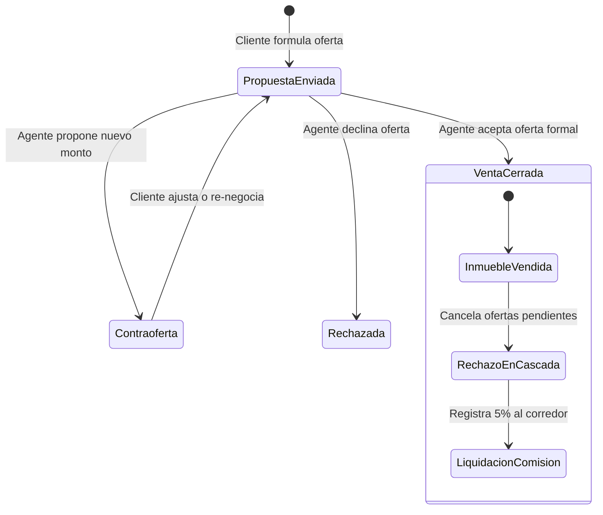

# 📄 FICHA TÉCNICA OFICIAL — RealEstateApp V2
> **ALR COMPANY — División de Ingeniería de Software**  
> **Líder & Fundador:** Angel Luis Rosario ([github.com/ALR1730](https://github.com/ALR1730))  
> **Mentor & Base Formativa:** Ing. Leonardo (Cátedra de Programación III, Onion Architecture & .NET)  
> **Estándar de Calidad:** Turing-Grade · Clean Onion Architecture · DDD  
> **Fecha de Emisión:** Octubre 2026 · **Versión de la Plataforma:** 2.0.0 (Release Enterprise)

---

## 1. IDENTIFICACIÓN Y GENERALIDADES DEL SISTEMA

| Parámetro | Detalle |
| :--- | :--- |
| **Nombre del Software** | **RealEstateApp** (Plataforma Integral de Gestión e Intermediación Inmobiliaria) |
| **ID de Repositorio** | `ALR1730/RealEstateApp` |
| **Tipo de Aplicación** | Sistema Transaccional Web Desacoplado (Backend REST API + Frontend SPA) |
| **Propósito de Negocio** | Gestión de intermediación inmobiliaria en República Dominicana, automatización de venta con regla atómica de cierre, simulación hipotecaria bancaria en RD$, avalúos automatizados (AVM), pipeline de prospectos y comunicación bidireccional en tiempo real. |
| **Mercado Objetivo** | Firmas inmobiliarias, agentes independientes, inversionistas y desarrolladores en RD. |
| **Moneda Base** | Peso Dominicano (**DOP / RD$**) con soporte multidivisa en UI. |
| **Localización** | `es-DO` (República Dominicana). Formato de números y fechas local. |

---

## 2. MATRIZ DE ESPECIFICACIONES TÉCNICAS (TECH STACK)

### 2.1 Backend (.NET Web API)
* **Framework Runtime:** **.NET 10.0** (C# 13, SDK habilitado con Implicit Usings y Nullability).
* **Tipo de Proyecto:** ASP.NET Core Web API RESTful (`Microsoft.NET.Sdk.Web`).
* **Arquitectura:** **Onion Architecture / Clean Architecture** en capas estrictas.
* **Persistencia y ORM:**
  * **Entity Framework Core 10.0.10** (Code-First con migraciones y semillas automáticas).
  * **Proveedores de Datos:** SQL Server (`Microsoft.EntityFrameworkCore.SqlServer`), In-Memory (`Microsoft.EntityFrameworkCore.InMemory`) y soporte PostgreSQL (`Npgsql.EntityFrameworkCore.PostgreSQL`).
  * **Geolocalización:** `NetTopologySuite 2.6.0` y `NetTopologySuite.SqlServer` para cómputo geoespacial de propiedades.
* **Identidad y Seguridad:**
  * ASP.NET Core Identity (`Microsoft.AspNetCore.Identity.EntityFrameworkCore 10.0.10`).
  * Autenticación basada en **JWT Bearer Tokens** (`Microsoft.AspNetCore.Authentication.JwtBearer 10.0.10`).
  * Control de acceso basado en Roles y Claims (`Admin`, `Agent`, `Client`, `Developer`, `Owner`).
* **Comunicación en Tiempo Real:** **SignalR Hubs** (`ChatHub`, `NotificationHub`) sobre WebSockets con fallback a Server-Sent Events / Long Polling.
* **Mapeo de Objetos:** **AutoMapper 16.2.0** (`GeneralProfile` modularizado por dominios).
* **Manejo de Errores y Estandarización:** Filtro global de excepciones conforme a **RFC 7807 (ProblemDetails)**.
* **Documentación y Exploración:** Swagger / OpenAPI 3.0 (`Swashbuckle.AspNetCore 7.0.0`).

### 2.2 Frontend (React SPA)
* **Librería Núcleo:** **React 18.3.1** con **TypeScript 5.7.2** (strict mode).
* **Herramienta de Construcción:** **Vite 6.4.3** (HMR ultra-rápido, code splitting dinámico vía `React.lazy` y `Suspense`).
* **Estilos y Maquetación:** **Tailwind CSS 3.4.16** + **PostCSS** + **Autoprefixer**.
* **Diseño y Estética:** Dark Mode nativo (`class`), Glassmorphism, paleta HSL institucional y micro-interacciones.
* **Iconografía:** **Lucide React 0.468.0**.
* **Enrutamiento:** **React Router DOM 6.28.0** con guardas centralizadas de autorización (`ProtectedRoute` multi-rol).
* **Cliente HTTP:** **Axios 1.7.9** con interceptores automáticos para inserción de JWT y refresco de estado.
* **Cliente Tiempo Real:** `@microsoft/signalr 8.0.7` conectado mediante proxy interno Vite.
* **Cartografía y Mapas:** **Leaflet 1.9.4** + **React-Leaflet 4.2.1** con capas interactivas de inmuebles.
* **Métricas y Gráficos:** **Recharts 3.10.1** para analíticas de KPIs y evolución de precios.
* **Calendarios:** **FullCalendar 6.1.21** (`@fullcalendar/react`, daygrid, timegrid, interaction) para gestión de citas inmobiliarias.

### 2.3 Testing y Aseguramiento de Calidad (QA)
* **Backend:** **xUnit 2.9.2** + **Moq 4.20.72** + **FluentAssertions 6.12.2** + **Coverlet Collector 6.0.2** (Suite de pruebas unitarias de servicios, controladores, filtros y mapeos con 100% de éxito bajo patrón AAA).
* **Frontend:** **Vitest 4.1.11** + **React Testing Library 16.1.0** + `@testing-library/jest-dom 6.6.3` (87 pruebas unitarias en 11 suites pasando 100% en verde sin errores de JSDOM).
* **Manejo de Errores Estandarizado:** Helper universal `getApiErrorMessage` desacoplado y compatible con especificación **RFC 7807 (ProblemDetails)** y validaciones ASP.NET Core.
* **Matrices de Aceptación E2E:** 141 aserciones de integración determinística multi-rol validadas contra API real.

---

## 3. ARQUITECTURA DE SOFTWARE (CLEAN ONION ARCHITECTURE)

La solución respeta de forma estricta la **Regla de Dependencias Inversas**, donde el núcleo del negocio es agnóstico a bases de datos, protocolos de transporte o interfaces de usuario.

```text
                                 ┌─────────────────────────────────────────┐
                                 │   PRESENTATION / DELIVERY LAYER         │
                                 │  - RealEstateApp.Presentation.WebApi    │
                                 │  - RealEstateApp.ClientApp (SPA)        │
                                 └────────────────────┬────────────────────┘
                                                      │
                                 ┌────────────────────▼────────────────────┐
                                 │   INFRASTRUCTURE LAYER                  │
                                 │  - Persistence (EF Core, SQL, Identity) │
                                 │  - Shared (Culture es-DO, File Storage) │
                                 └────────────────────┬────────────────────┘
                                                      │
                                 ┌────────────────────▼────────────────────┐
                                 │   APPLICATION LAYER (Core.Application)  │
                                 │  - Use Cases & Services (24 Services)   │
                                 │  - DTOs, ViewModels & Mapping Profiles  │
                                 │  - Financial Mortgage Engine            │
                                 └────────────────────┬────────────────────┘
                                                      │
                                 ┌────────────────────▼────────────────────┐
                                 │   DOMAIN LAYER (Core.Domain)            │
                                 │  - Entities (26 Core Business Entities) │
                                 │  - Invariants, Enums & Exceptions       │
                                 └─────────────────────────────────────────┘
```

### Detalle de Proyectos de la Solución:

1. **`RealEstateApp.Core.Domain`**:
   - Cero dependencias externas. Contiene 26 entidades de negocio puras: `Property`, `Offer`, `Commission`, `PropertyAppointment`, `Chat`, `MortgageSimulation`, `BuyAbilityEvaluation`, `LeadPipeline`, `PropertyValuation`, `AgentVerification`, `SubscriptionPlan`, `AgentSubscription`, etc.
2. **`RealEstateApp.Core.Application`**:
   - Orquesta la lógica de negocio, validaciones, mapeos y contratos de interfaces. Contiene 24 servicios dedicados (ej. `PropertyService`, `OfferService`, `CommissionService`, `PropertyValuationService`).
3. **`RealEstateApp.Infrastructure.Persistence`**:
   - Implementa repositorios genéricos y especializados, configuración de `ApplicationDbContext` con Fluent API, soporte espacial con `NetTopologySuite`, gestión de usuarios `ApplicationUser` y semillas de arranque (`DefaultRoles`, `DefaultUsers`).
4. **`RealEstateApp.Infrastructure.Shared`**:
   - Proveedores de infraestructura transversal: configuración de cultura `es-DO`, servicios de almacenamiento físico de imágenes/documentos y servicios de comunicación.
5. **`RealEstateApp.Presentation.WebApi`**:
   - Expone 25 controladores RESTful versionados (`/api/v1/...`), filtros de autenticación JWT y los Hubs de SignalR.
6. **`RealEstateApp.ClientApp`**:
   - Aplicación de página única (SPA) modularizada por portales de usuario según el rol autenticado.

---

## 4. MATRIZ DE ROLES Y PERMISOS DEL SISTEMA

| Rol | Alcance Operativo | Capacidades Principales en la Plataforma |
| :--- | :--- | :--- |
| **🏢 Administrador** (`Admin`) | Control y Supervisión Global | • Dashboard de KPIs de rendimiento inmobiliario.<br>• Reasignación masiva de cartera de inmuebles entre corredores.<br>• Activación / inactivación de agentes y validación KYC.<br>• Mantenimiento de catálogos (Tipos de Propiedad, Ventas, Mejoras).<br>• Gestión de comisiones globales y liquidación.<br>• Creación de cuentas de Administradores y Desarrolladores. |
| **👔 Agente Inmobiliario** (`Agent`) | Intermediación y Venta Activa | • Publicación y gestión de inmuebles (hasta 15 fotos, video tours, 360°).<br>• Recepción de ofertas y **cierre atómico de venta**.<br>• Control de pipeline de prospectos (Kanban Leads).<br>• Gestión de citas y disponibilidad horaria en calendario.<br>• Chat directo en vivo con clientes por propiedad.<br>• Resumen y cobro de comisiones inmobiliarias. |
| **🛒 Cliente / Inversionista** (`Client`) | Búsqueda, Análisis y Compra | • Búsqueda avanzada con filtros multidimensionales y mapa interactivo.<br>• **Simulador hipotecario bancario** en RD$ con amortización francesa.<br>• Formulación de ofertas formales y seguimiento de contraofertas.<br>• Agendamiento de visitas presenciales con confirmación del agente.<br>• Guardado de favoritos y búsquedas automatizadas.<br>• Calificación y reseñas verificadas post-cierre. |
| **🏠 Propietario** (`Owner`) | Venta Directa Patrimonial | • Publicación de inmuebles propios (máximo 2 propiedades activas).<br>• Seguimiento de estado y ajuste de precios de venta.<br>• Registro de historial de variaciones de valor comercial. |
| **💻 Desarrollador API** (`Developer`) | Integración y Extensibilidad | • Portal dedicado con acceso y consulta a documentación Swagger.<br>• Mantenimiento y consulta de catálogos del sistema mediante API tokens. |

---

## 5. REGLAS DE NEGOCIO CRÍTICAS E INVARIANTES



1. **Regla Atómica de Cierre Transaccional en Cascada:**
   - La aceptación de una oferta sobre un inmueble ejecuta una transacción atómica mediante `IUnitOfWork`.
   - El estado de la propiedad cambia de forma irreversible a `Vendida`.
   - Todas las demás ofertas competidoras en estado `Pending` pasan automáticamente a `Rejected`.
   - Se bloquea la recepción de nuevas ofertas y citas sobre dicho inmueble.
   - Se calcula y asienta de forma inmediata la comisión mercantil correspondiente (5% estándar) vinculada al agente.
2. **Límite de Inventario para Propietarios:**
   - Todo usuario con rol `Owner` tiene una cuota fija estricta de **2 propiedades activas** simultáneamente. Cualquier intento de registrar una tercera es rechazado en servidor con código HTTP 400.
3. **Simulador Hipotecario (Sistema Francés en RD$):**
   - Implementa la fórmula financiera:
     $$A = P \times \frac{i(1+i)^n}{(1+i)^n - 1}$$
   - Calcula amortización mensual fija, segregación de capital e interés devengado, con exportación imprimible de la tabla año a año.
4. **Códigos de Identificación Únicos (Property Code):**
   - Cada inmueble cuenta con un identificador de 6 caracteres alfanuméricos únicos generados aleatoriamente y no secuenciales para prevenir enumeración maliciosa.
5. **Avalúo Automatizado (AVM) y BuyAbility:**
   - Algoritmo de valuación inmobiliaria basado en muestras comparables por sector, metraje y amenidades.
   - Evaluación de capacidad de pago crediticio basada en ingresos brutos y endeudamiento reportado.

---

## 6. CATÁLOGO DE SUPERFICIE DE API REST (v1) & HUBS

### Controladores RESTful (`/api/v1/...`):
* `AccountController`: Registro multi-rol, autenticación JWT, confirmación de correo, perfil de usuario.
* `AdminController`: Dashboard KPIs, gestión de usuarios, reasignación de cartera de propiedades.
* `AgentsController`: Directorio público y consulta detallada de corredores autorizados.
* `AiSearchController`: Búsqueda semántica inteligente de inmuebles.
* `AppointmentsController`: Ciclo de vida de visitas presenciales (solicitar, confirmar, cancelar).
* `BuyAbilityController`: Cálculo de aptitud crediticia y capacidad de compra del prospecto.
* `ChatsController`: Historial y mensajería directa vinculada a la propiedad.
* `CommissionsController`: Auditoría, liquidación y consulta de comisiones devengadas.
* `CurrencyController`: Consulta y sincronización de tasas de cambio (DOP / USD).
* `DocumentsController`: Repositorio documental legal por inmueble (títulos, contratos).
* `FavoritesController`: Gestión del portafolio personal de propiedades guardadas.
* `ImprovementsController`: Mantenimiento del catálogo maestro de mejoras/amenidades.
* `LeadsController`: Pipeline de oportunidades comerciales (etapas Kanban).
* `OffersController`: Envío, contraofertas y aceptación con ejecución transaccional.
* `OwnersController`: Administración de inventario patrimonial (regla de 2 propiedades).
* `PropertiesController`: CRUD maestro de propiedades, filtros facetados, subida multipart de fotos.
* `PropertyTypesController`: Mantenimiento de categorías edilicias (Apartamentos, Villas, Casas, etc.).
* `ProvincesController`: Catálogo territorial oficial de República Dominicana (provincias y municipios).
* `ReviewsController`: Calificación y testimonios de clientes hacia agentes tras el cierre.
* `SaleTypesController`: Modalidades transaccionales (Venta directa, Alquiler, etc.).
* `SavedSearchesController`: Alertas de búsqueda personalizadas para compradores.
* `SimulatorController`: Endpoint de cómputo financiero de amortización hipotecaria.
* `SubscriptionsController`: Gestión de membresías y planes para agentes.
* `ValuationController`: Motor de valuación AVM automatizada.
* `VerificationsController`: Protocolo KYC para validación de agentes y credenciales de corredor.

### Canales WebSocket en Tiempo Real (SignalR):
* `/hubs/chat`: Comunicación bidireccional instantánea entre cliente y agente inmobiliario.
* `/hubs/notifications`: Emisión en vivo de alertas del sistema (nuevas ofertas, confirmación de citas, cambios de estado).

---

## 7. ESTRUCTURA DEL PROYECTO CLIENTE (SPA)

```text
src/Presentation/RealEstateApp.ClientApp/
├── src/
│   ├── api/             # axiosClient.ts y services.ts (abstracción tipada completa)
│   ├── components/      # Componentes UI reutilizables (chat, simulator, offers, common)
│   ├── context/         # AuthContext, NotificationContext, ThemeContext, CurrencyContext
│   ├── pages/
│   │   ├── admin/       # Gestión directiva (AdminDashboard, ManageAdmins, ManageDevelopers...)
│   │   ├── agent/       # Portal corredor (Properties, Leads Kanban, Commissions, KYC...)
│   │   ├── auth/        # Login, Registro, Confirmación de Correo, Olvido de Clave
│   │   ├── client/      # Portal comprador (Favoritos, Mis Ofertas, Citas, Simulador)
│   │   ├── developer/   # Portal técnico (Endpoints, Catálogos, Documentación API)
│   │   ├── owner/       # Portal propietario (Mis Propiedades con cupo de 2)
│   │   └── public/      # Catálogo, Detalle de Inmueble, Perfil de Agentes, Comparador
│   ├── tests/           # Suite Vitest con jsdom
│   ├── types/           # Definiciones TypeScript unificadas
│   └── utils/           # Formateadores de moneda (RD$), fechas y cálculos
```

---

## 8. CREDENCIALES Y CUENTAS DEMO PREDETERMINADAS

| Rol de Usuario | Correo Electrónico | Contraseña Predeterminada |
| :--- | :--- | :--- |
| **🏢 Administrador** | `admin@realestate.com` | `Admin123!` |
| **👔 Agente Inmobiliario** | `agent@realestate.com` | `Agent123!` |
| **👔 Agente Secundario** | `agent2@realestate.com` | `Agent123!` |
| **🛒 Cliente Comprador** | `client@realestate.com` | `Client123!` |
| **🛒 Cliente Secundario** | `client2@realestate.com` | `Client123!` |
| **🏠 Propietario** | `owner@realestate.com` | `Owner123!` |
| **💻 Desarrollador API** | `developer@realestate.com` | `Developer123!` |

---

## 9. COMANDOS OPERATIVOS DE COMPILACIÓN Y VERIFICACIÓN

### 9.1 Backend (.NET)
```powershell
# Compilar solución completa
dotnet build RealEstateApp.slnx

# Ejecutar suite de pruebas unitarias (79 tests)
dotnet test RealEstateApp.slnx

# Iniciar servidor API en localhost:5196
dotnet run --project src/Presentation/RealEstateApp.Presentation.WebApi
```

### 9.2 Frontend (React SPA)
```powershell
cd src/Presentation/RealEstateApp.ClientApp

# Instalar dependencias
npm install

# Validar tipado y empaquetar bundle para producción
npm run build

# Ejecutar pruebas unitarias (87 tests Vitest en 11 suites)
npm run test

# Iniciar servidor de desarrollo en localhost:5173
npm run dev
```

---

## 10. DICTAMEN DE CONFORMIDAD TÉCNICA
Esta ficha técnica certifica que **RealEstateApp** cumple satisfactoriamente con los principios de Clean Architecture, separación estricta de responsabilidades, seguridad en endpoints mediante JWT y roles, atomicidad en transacciones financieras y experiencia de usuario fluida y reactiva en tiempo real.
