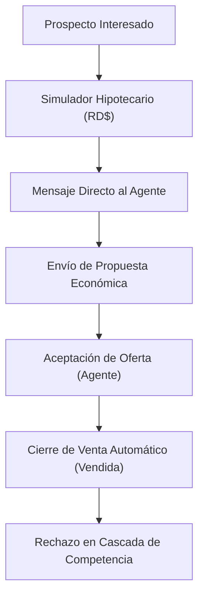

# 📈 Propuesta Comercial y Presentación Ejecutiva — RealEstateApp

---

## 🎯 Objetivos de la Plataforma
Ofrecer una solución integral para **inmobiliarias, desarrolladores y agentes independientes** en República Dominicana que automatice el ciclo comercial, incremente la conversión de prospectos y garantice un control administrativo total.

---

## 🌟 Beneficios Clave para la Empresa Inmobiliaria

### 1. **Transformación Digital del Portafolio**
- Fichas de inmuebles de alto impacto visual con soporte de hasta **15 fotografías**, mapas de **Google Maps**, enlaces a **Video Tours** y vistas virtuales **Tour 360°**.
- Formato adaptado 100% al mercado local con precios y simulaciones en **Pesos Dominicanos (RD$)**.

### 2. **Simulador Hipotecario de Nivel Bancario**
- Calcula cuotas mensuales fijas bajo el **Sistema Francés**.
- Desglosa visualmente el porcentaje de enganche, capital prestado e intereses acumulados.
- Permite al comprador **imprimir su tabla de amortización** antes de realizar una oferta formal.

### 3. **Cierre de Ventas Garantizado y Seguro**
- **Regla Atómica de Negocio:** Al aceptar una propuesta económica, el inmueble pasa inmediatamente a estado **"Vendida"**, cancelando automáticamente las ofertas competidoras y bloqueando solicitudes adicionales.

### 4. **Retención de Clientes y Leads**
- Canal de chat privado por propiedad que conecta al comprador directamente con el agente responsable sin intermediarios externos.

---

## 🔑 Cuentas de Acceso para la Demostración

| Rol | Usuario (Email) | Contraseña | Valor Demostrable |
| :--- | :--- | :--- | :--- |
| **Administrador** | `admin@realestate.com` | `Admin123!` | Dashboard de KPIs, reasignación de agentes y borrado seguro de publicaciones. |
| **Agente** | `agent@realestate.com` | `Agent123!` | Publicación de propiedades, chat directo y aceptación de ofertas con cierre automático. |
| **Cliente** | `client@realestate.com` | `Client123!` | Simulación hipotecaria en RD$, favoritos, mensajería y envío de propuestas. |

---

## 🚀 Próximos Pasos de Integración
1. **Personalización Institucional:** Ajuste de logotipo, colores corporativos e información de contacto de la inmobiliaria.
2. **Carga de Inventario:** Importación masiva de inmuebles existentes.
3. **Conexión API Externa:** Integración opcional con CRM corporativos o aplicaciones móviles mediante Web API JWT.
