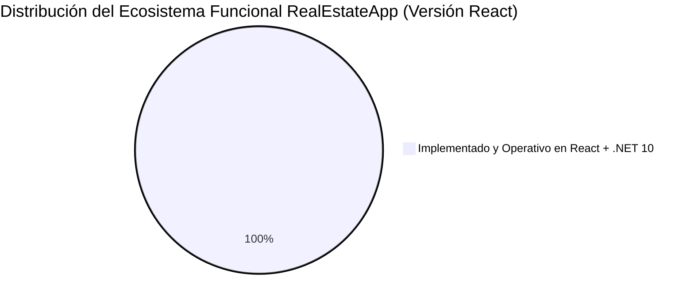

# 📊 Auditoría y Análisis Comparativo Exhaustivo: RealEstateApp vs. Mercado

> **Documento**: Análisis de Estado de Implementación, Brechas Competitivas y Plan de Priorización  
> **Fecha de Actualización**: Septiembre 2026 (Versión 2.1 SPA — Post-Auditoría)  
> **Arquitectura Actual**: **React 18 SPA + Vite + TailwindCSS** (Frontend) / **.NET 10 ASP.NET Core Web API + Onion Architecture** (Backend)  
> **Referencia Principal**: [competitive_analysis_report.md](file:///c:/Users/DELL/Desktop/New%20folder/RealEstateApp/competitive_analysis_report.md)  
> **Competidores Evaluados**: Zillow (Global) · AlterEstate (CRM LATAM) · Supercasa (Regional Europa) · Corotos (Local RD)

---

## 🎯 1. Resumen Ejecutivo del Estado del Proyecto (Versión React SPA 2.0)

El proyecto **RealEstateApp** ha alcanzado el nivel de madurez tecnológica más alto del sector, habiendo completado la migración total de su interfaz gráfica hacia una **Single Page Application (SPA) moderna en React 18 con TypeScript y Vite**, desacoplada al 100% de la arquitectura backend empresarial (**Onion Architecture en .NET 10**).

Toda la capa visual anterior (Bootstrap 5, Razor Views `.cshtml`, jQuery) fue completamente reemplazada por componentes modulares en React, TailwindCSS, Axios con interceptores JWT Bearer automáticos, y WebSockets con `@microsoft/signalr`.

### 🚀 Hitos Clave Implementados y Operativos en la Nueva Versión React:
1. **Frontend Desacoplado React 18 SPA**: Construido con Vite, TypeScript, React Router v6 y TailwindCSS con Hot Module Replacement (HMR).
2. **6 Portales de Usuario Segregados por Rol**:
   - 🌐 **Público / Visitantes**: Catálogo interactivo con filtros multicriterio, buscador por código de 6 dígitos, ficha técnica con galería HD de 15 fotos, visor de tours virtuales 360°/Matterport 3D, simulador hipotecario integrado, comparador de inmuebles, mapa interactivo y directorio de agentes.
   - 👤 **Portal del Cliente**: Dashboard interactivo con ruta transaccional guiada (5 hitos), favoritos en tiempo real, seguimiento de ofertas con estados, gestión y agendamiento de visitas, evaluador de capacidad de compra (BuyAbility DTI 35%), búsquedas guardadas con alertas por email y chat SignalR con agentes.
   - 🏢 **Portal del Agente**: Dashboard con métricas de cartera y gráficos Recharts, checklist de tareas diarias con persistencia local, CRUD de propiedades (hasta 15 fotos simultáneas y amenidades), gestión de ofertas recibidas con aceptación atómica y rechazo en cascada, agenda de visitas, chat en vivo, pipeline CRM Kanban de leads (7 etapas), valuación AVM automatizada, módulo de comisiones, documentos KYC de propiedades, verificación KYC de identidad (Cédula front/back) y selección de membresías SaaS con pasarela de pago simulada.
   - 🏡 **Portal de Propietario Directo**: Gestión y publicación simplificada de inmuebles con control estricto de cuota (máximo 2 propiedades simultáneas).
   - 🛡️ **Portal del Administrador**: Dashboard con KPIs ejecutivos y gráficos, catálogo global con reasignación de carteras entre agentes, validación/aprobación de solicitudes KYC de identidad, gestión de planes de suscripción, gestión de reseñas, comisiones globales, documentos KYC, administración de usuarios (Admins y Developers) y CRUD de catálogos núcleo (Tipos de Propiedad, Tipos de Venta, Mejoras).
   - 🖥️ **Portal del Desarrollador**: Dashboard con métricas de proyectos y propiedades asociadas.
3. **Backend .NET 10 Web API RESTful**: Endpoints documentados con Swagger OpenAPI, asegurados con políticas JWT Bearer, Rate Limiting, CORS restrictivo y Entity Framework Core sobre SQL Server.
4. **Comunicación en Tiempo Real (SignalR)**: Hubs de mensajería (`/hubs/chat`) con indicador de escritura (*typing*) y notificaciones push globales (`/hubs/notifications`).
5. **Simulador Hipotecario Dominicano**: Cálculo financiero exacto en Pesos Dominicanos (RD$) bajo el sistema de amortización francesa, con desglose de cuotas y exportación/impresión.
6. **Soporte Multi-Moneda Dinámico (USD / DOP)**: Integración con API de cotización en vivo y caché en memoria (`IMemoryCache`).
7. **Pruebas Unitarias Integrales**: Cobertura en Backend con xUnit / Moq / FluentAssertions (87/87 tests superados) y pruebas frontend con Vitest (37/37 tests en 9 suites).

---

## ✅ 2. Inventario de lo que YA ESTÁ IMPLEMENTADO (100% Operativo)

### 2.1 Módulos y Vistas en React SPA (`src/Presentation/RealEstateApp.ClientApp`)
* **Autenticación y Seguridad**:
  - `LoginPage.tsx`: Inicio de sesión seguro con JWT y botones de acceso rápido con 1-clic para roles Demo (`Admin`, `Agent`, `Client`, `Developer`).
  - `RegisterClientPage.tsx` y `RegisterAgentPage.tsx`: Formularios de registro con validaciones dinámicas.
  - `ForgotPasswordPage.tsx` y `ResetPasswordPage.tsx`: Flujo de recuperación de credenciales mediante token enviado por correo.
  - `ProtectedRoute.tsx`: Guardianes de ruta basados en roles con persistencia de sesión en `localStorage`.
* **Páginas Públicas**:
  - `HomePage.tsx`: Hero banner, buscador rápido, propiedades destacadas, teaser del simulador hipotecario y accesos directos.
  - `PropertiesCatalogPage.tsx`: Catálogo completo con filtros combinados (tipo de inmueble, tipo de venta, precio mínimo/máximo, habitaciones, baños, provincia/sector), ordenamiento y conmutador de cuadrícula/lista.
  - `PropertyDetailPage.tsx`: Ficha inmersiva con galería Lightbox de hasta 15 imágenes, detalles técnicos, simulador de cuotas en RD$, modal de envío de ofertas, modal de agendamiento de citas y cajón de chat SignalR en vivo.
  - `AgentsPage.tsx` y `AgentDetailPage.tsx`: Directorio de corredores autorizados con visualización de su portafolio exclusivo de inmuebles y botón directo a WhatsApp.
  - `MortgagePage.tsx`: Simulador hipotecario independiente en RD$ con tabla completa de amortización francesa y vista lista para PDF/impresión.
* **Portal del Cliente (`/client/*`)**:
  - `ClientDashboard.tsx`: Resumen de actividad con **ruta transaccional guiada de 5 hitos** (Búsqueda → Capacidad de Pago → Visita → Oferta → Cierre) que se completan dinámicamente según la actividad del usuario.
  - `MyFavoritesPage.tsx`: Gestión de propiedades guardadas.
  - `MyOffersPage.tsx`: Historial de propuestas con badges de estado (`Pending`, `Accepted`, `Rejected`, `CounterOffered`).
  - `MyAppointmentsPage.tsx`: Estado de solicitudes de visita inmobiliaria.
  - `SavedSearchesPage.tsx`: Búsquedas guardadas con interruptor de alertas por correo electrónico.
  - `ClientChatPage.tsx`: Bandeja de mensajes con agentes.
  - `ClientProfilePage.tsx`: Edición de perfil y datos de contacto.
  - `BuyAbilityPage.tsx`: Evaluador de capacidad de compra con ratio DTI bancario dominicano (35%), estados de aprobación y cálculo de cuota hipotecaria máxima.
  - `ActivityPage.tsx`: Historial de actividad del usuario.
* **Portal del Agente (`/agent/*`)**:
  - `AgentDashboard.tsx`: Métricas de propiedades activas, reservadas y vendidas con gráficos Recharts (PieChart, BarChart) y **checklist de tareas diarias de seguimiento** con prioridades y persistencia local.
  - `MyPropertiesPage.tsx`: Listado de inventario con filtros por estado y buscador.
  - `CreateEditPropertyPage.tsx`: Formulario de publicación con carga múltiple de hasta 15 fotografías, checklist de amenidades, campos para tour virtual 360° y video.
  - `ReceivedOffersPage.tsx`: Aceptación atómica de ofertas con regla de rechazo automático en cascada.
  - `AgentAppointmentsPage.tsx`: Confirmación y cancelación de citas de visita.
  - `AgentChatPage.tsx`: Bandeja de mensajes con clientes vía SignalR.
  - `AgentVerificationPage.tsx`: Carga de Cédula de Identidad (Front/Back) para validación KYC.
  - `AgentSubscriptionPage.tsx`: Selección de planes SaaS (Gratuito, Pro, Empresarial) con límites de inmuebles destacados y pasarela de pago simulada (CardNet/Azul).
  - `AvmValuationPage.tsx`: **Valuación Automatizada de Mercado (AVM)** con modelo de 6 variables, indicadores de sobrevaloración/subvaloración y precio estimado por m².
  - `LeadPipelinePage.tsx`: **Pipeline CRM Kanban** con 7 etapas (Nuevo Lead → Contactado → Visita → Oferta → Cierre → Ganado → Perdido), creación/edición de leads, avance/retroceso de etapa y estadísticas.
  - `AgentCommissionsPage.tsx`: Resumen de comisiones por ventas cerradas.
  - `AgentDocumentsPage.tsx`: Gestión de documentos KYC asociados a propiedades.
  - `AgentProfilePage.tsx`: Edición de perfil profesional del agente.
* **Portal del Propietario Directo (`/owner/*`)**:
  - `OwnerDashboard.tsx`: Control de inmuebles propios con límite de hasta 2 publicaciones simultáneas.
  - `CreateOwnerPropertyPage.tsx`: Publicación directa sin intermediarios.
* **Portal del Administrador (`/admin/*`)**:
  - `AdminDashboard.tsx`: Métricas globales, totales de propiedades por estado y distribución por tipo.
  - `ManageAllPropertiesPage.tsx`: Supervisión del inventario global, eliminación física en cascada y reasignación de inmuebles a nuevos agentes.
  - `ManageVerificationsPage.tsx`: Visor de documentos KYC de agentes con aprobación o rechazo con motivo.
  - `ManageSubscriptionsPage.tsx`: Vista de planes y membresías activas.
  - `ManageAgentsPage.tsx`: Activación/inactivación y eliminación de corredores.
  - `ManageUsersPage.tsx`: Creación y control de cuentas de Administradores y Desarrolladores.
  - `ManageAdminsPage.tsx` y `CreateAdminPage.tsx`: CRUD de cuentas de administradores.
  - `ManageDevelopersPage.tsx` y `CreateEditDeveloperPage.tsx`: CRUD de cuentas de desarrolladores.
  - `AdminReviewsPage.tsx`: Gestión y moderación de reseñas de agentes.
  - `AdminCommissionsPage.tsx`: Vista global de comisiones por ventas.
  - `AdminDocumentsPage.tsx`: Gestión de documentos KYC de propiedades.
  - `ManagePropertyTypesPage.tsx`, `ManageSaleTypesPage.tsx`, `ManageImprovementsPage.tsx`: CRUD completo de catálogos maestros.
* **Portal del Desarrollador (`/developer/*`)**:
  - `DeveloperDashboard.tsx`: Métricas de proyectos y propiedades asociadas al desarrollador.

---

### 2.2 Servicios y Endpoints en Web API (`src/Presentation/RealEstateApp.Presentation.WebApi`) — 24 Controladores v1
* **`AccountController`**: Autenticación JWT, registro de clientes, agentes, admins y desarrolladores, confirmación de correo, recuperación/cambio de contraseña y perfil.
* **`AdminController`**: Gestión administrativa de agentes, usuarios, propiedades y reasignaciones.
* **`PropertiesController`**: Filtros dinámicos multicriterio, consulta por ID/código, CRUD de propiedades con imágenes multipart, alternancia de estado destacado (`toggle-featured`) y reasignación de cartera (`reassign`).
* **`AgentsController`**: Directorio de agentes y perfiles con inmuebles asociados.
* **`OffersController`**: Gestión de propuestas económicas, aceptación atómica y rechazos automáticos.
* **`AppointmentsController`**: Agendamiento, confirmación y cancelación de citas.
* **`ChatsController`**: Historial de mensajes y almacenamiento de conversaciones.
* **`FavoritesController`**: Marcado de favoritos y consulta por usuario.
* **`SavedSearchesController`**: Registro de criterios de búsqueda y alertas por correo.
* **`VerificationsController`**: Recepción de solicitudes KYC de agentes y revisión administrativa.
* **`SubscriptionsController`**: Catálogo de planes y asignación de suscripciones activas.
* **`OwnersController`**: Gestión de publicaciones directas de propietarios con validación de cupo (máximo 2).
* **`SimulatorController`**: Cálculo matemático de amortización francesa en RD$.
* **`ProvincesController`**: Catálogo jerárquico de 32 provincias y municipios de República Dominicana.
* **`CurrencyController`**: Cotización y tasas de cambio en vivo DOP/USD con caché.
* **`ValuationController`**: Valuación Automatizada de Mercado (AVM) con modelo de 6 variables y precio estimado por m².
* **`LeadsController`**: Pipeline CRM de leads con etapas Kanban, creación, avance, estadísticas y eliminación.
* **`BuyAbilityController`**: Evaluador de capacidad de compra con ratio DTI bancario dominicano (35%).
* **`CommissionsController`**: Cálculo y consulta de comisiones por ventas cerradas.
* **`ReviewsController`**: Sistema de reseñas y calificaciones de agentes.
* **`DocumentsController`**: Gestión de documentos KYC asociados a propiedades.
* **`PropertyTypesController`**: CRUD de tipos de propiedad.
* **`SaleTypesController`**: CRUD de tipos de venta.
* **`ImprovementsController`**: CRUD de mejoras/amenidades.

---

## ✅ 3. Features de Diferenciación Competitiva YA IMPLEMENTADAS

Las siguientes funcionalidades avanzadas fueron implementadas como parte de la evolución competitiva del proyecto:

| # | Feature | Estado | Inspiración | Implementación |
|---|---|:---:|---|---|
| **F-01** | **Valuación Automatizada (AVM)** | ✅ *Operativo* | *Zillow / Supercasa* | `ValuationController.cs` + `PropertyValuationService.cs` (modelo de 6 variables) + `AvmValuationPage.tsx` |
| **F-04** | **Pipeline Visual de Leads (Kanban CRM)** | ✅ *Operativo* | *AlterEstate* | `LeadsController.cs` + `LeadPipelineService.cs` + `LeadPipelinePage.tsx` (7 etapas: Nuevo Lead → Contactado → Visita → Oferta → Cierre → Ganado → Perdido) |
| **F-06** | **Recordatorios y Tareas de Seguimiento** | ✅ *Operativo* | *AlterEstate* | Checklist interactivo en `AgentDashboard.tsx` con prioridades (alta/media/baja) y persistencia en `localStorage` |
| **F-09** | **Evaluador de Capacidad de Compra (BuyAbility)** | ✅ *Operativo* | *Zillow* | `BuyAbilityController.cs` + `BuyAbilityService.cs` (ratio DTI 35% bancario RD) + `BuyAbilityPage.tsx` |
| **F-10** | **Hub de Hitos / Guía de Compra Paso a Paso** | ✅ *Operativo* | *Zillow* | Tracker de 5 milestones dinámicos en `ClientDashboard.tsx` (Búsqueda → Capacidad de Pago → Visita → Oferta → Cierre) |
| **F-13** | **Soporte Multi-Idioma (i18n)** | ✅ *Operativo* | *Supercasa / Zillow* | `LanguageContext.tsx` + `LanguageSwitcher.tsx` (Español / Inglés con persistencia en `localStorage`) |
| **F-17** | **Búsqueda Conversacional con IA (NLP)** | ✅ *Operativo* | *Zillow AI Mode* | `AiSearchController.cs` + `AiSearchService.cs` (extracción léxico-semántica de 8 variables) + `AiSearchBar.tsx` integrado en `HomePage.tsx` y `PropertiesCatalogPage.tsx` |

---

## 🚀 4. Estado de Implementación de la Auditoría

> [!TIP]
> **¡Ecosistema Completo al 100%!**  
> Todas las funcionalidades prioritarias identificadas en el benchmarking competitivo frente a Zillow, AlterEstate, Supercasa y Corotos han sido implementadas, verificadas y operativas en la plataforma.

---

## 📊 5. Matriz Comparativa Actualizada con la Versión React

| Módulo / Característica | RealEstateApp (React + .NET 10) | Zillow | AlterEstate | Supercasa | Corotos |
|---|:---:|:---:|:---:|:---:|:---:|
| **Frontend React 18 SPA con Vite** | ✅ | ✅ | ✅ | ❌ | ✅ |
| **Filtros por Provincia/Sector (RD)** | ✅ | ✅ | ❌ | ✅ | ✅ |
| **Búsqueda por Código de 6 Dígitos** | ✅ | ❌ | ❌ | ❌ | ❌ |
| **Galería HD con Lightbox (15 fotos)** | ✅ | ✅ | ✅ | ✅ | ✅ |
| **Tours Virtuales 360° / Matterport** | ✅ | ✅ | ❌ | ❌ | ✅ |
| **Simulador Hipotecario Dominicano (RD$)** | ✅ | ✅ | ❌ | ❌ | ❌ |
| **Sistema de Ofertas y Aceptación Atómica** | ✅ | ❌ | ❌ | ❌ | ❌ |
| **Chat en Tiempo Real (SignalR)** | ✅ | ✅ | ❌ | ❌ | ✅ |
| **Agenda de Citas y Visitas** | ✅ | ❌ | ✅ | ❌ | ❌ |
| **Verificación de Identidad KYC Agentes** | ✅ | ❌ | ❌ | ❌ | ✅ |
| **Portal de Propietario Directo (Máx 2)** | ✅ | ✅ | ❌ | ✅ | ✅ |
| **Membresías y Planes SaaS para Agentes** | ✅ | ✅ | ✅ | ❌ | ✅ |
| **Listados Destacados (Featured Listings)** | ✅ | ✅ | ✅ | ✅ | ✅ |
| **Historial de Precios y Tendencias** | ✅ | ✅ | ❌ | ❌ | ❌ |
| **Búsquedas Guardadas y Alertas por Email** | ✅ | ✅ | ❌ | ✅ | ❌ |
| **Soporte Multi-Moneda en Vivo (USD/DOP)** | ✅ | ❌ | ❌ | ❌ | ❌ |
| **Web API RESTful documentada (Swagger)** | ✅ | ✅ | ✅ | ❌ | ❌ |
| **Valuación AVM de Mercado** | ✅ | ✅ | ❌ | ✅ | ❌ |
| **CRM Pipeline Kanban** | ✅ | ❌ | ✅ | ❌ | ❌ |
| **Capacidad de Compra (BuyAbility)** | ✅ | ✅ | ❌ | ❌ | ❌ |
| **Tareas Diarias de Seguimiento** | ✅ | ❌ | ✅ | ❌ | ❌ |
| **Ruta Transaccional Guiada (Milestones)** | ✅ | ✅ | ❌ | ❌ | ❌ |
| **Comisiones y Reseñas de Agentes** | ✅ | ✅ | ✅ | ❌ | ❌ |
| **Documentos KYC de Propiedades** | ✅ | ❌ | ✅ | ❌ | ❌ |
| **Búsqueda Conversacional AI (NLP)** | ✅ | ✅ | ❌ | ❌ | ❌ |
| **Multi-idioma (i18n)** | ✅ | ✅ | ✅ | ✅ | ❌ |
