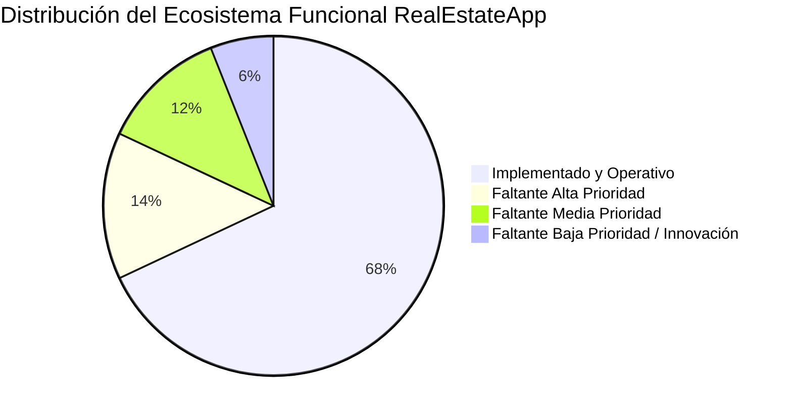
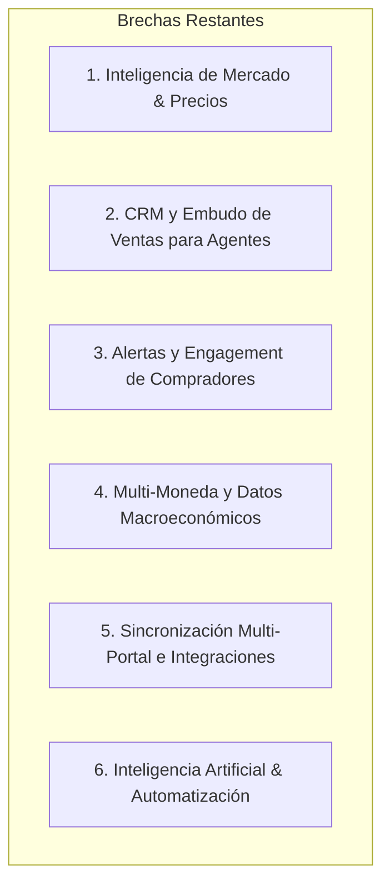

# 📊 Auditoría y Análisis Comparativo Exhaustivo: RealEstateApp vs. Mercado

> **Documento**: Análisis de Estado de Implementación, Brechas Competitivas y Plan de Priorización  
> **Fecha de Elaboración**: Agosto 2026  
> **Proyecto**: RealEstateApp V2 (.NET 10 / Onion Architecture)  
> **Referencia Principal**: [competitive_analysis_report.md](file:///c:/Users/DELL/Desktop/New%20folder/RealEstateApp/competitive_analysis_report.md)  
> **Competidores Evaluados**: Zillow (Global) · AlterEstate (CRM LATAM) · Supercasa (Regional Europa) · Corotos (Local RD)

---

## 🎯 1. Resumen Ejecutivo del Estado del Proyecto

Tu proyecto **RealEstateApp** se encuentra en un estado de madurez técnica muy alto. Cuenta con una arquitectura desacoplada empresarial (**Onion Architecture en .NET 10**), persistencia optimizada con **Entity Framework Core**, seguridad por **ASP.NET Core Identity & JWT Bearer**, y una capa visual rica con **PWA, Dark Mode, WebSockets (SignalR) y Leaflet Maps**.

A través de las fases de desarrollo recientes, se han cerrado con éxito las principales brechas que te separaban de **Corotos** (tu competidor directo en República Dominicana), tales como:
1. División geográfica oficial de RD (32 Provincias + Municipios + Sectores).
2. Verificación formal de identidad para agentes (`AgentVerification`).
3. Tours virtuales 3D integrados con visor embebido de **Matterport**.
4. Módulo y rol exclusivo de publicación para **Propietarios Directos**.
5. Sistema de **Planes y Suscripciones Pro/Premium** para agentes.
6. **Listados Destacados con prioridad** y distintivo dorado ⭐.

Este informe consolida **todo lo implementado** (con ubicación exacta en el código), identifica las **brechas restantes** para alcanzar el nivel de plataformas como *AlterEstate* y *Zillow*, y establece un **orden de prioridad estratégico** para guiar los siguientes ciclos de desarrollo.



---

## ✅ 2. Inventario de lo que YA ESTÁ IMPLEMENTADO

A continuación se detalla todo el arsenal funcional con el que cuenta tu solución actualmente, mapeado a sus entidades, servicios y controladores.

### 2.1 Búsqueda y Descubrimiento Geográfico
* **Filtros Multicriterio Dinámicos**: Filtrado simultáneo por tipo de propiedad, tipo de venta, rango de precio mínimo/máximo, cantidad de habitaciones y baños ([PropertyRepository.cs](file:///c:/Users/DELL/Desktop/New%20folder/RealEstateApp/src/Infrastructure/RealEstateApp.Infrastructure.Persistence/Repositories/PropertyRepository.cs)).
* **Búsqueda por Código Único (6 dígitos)**: Identificador alfanumérico único para compartir y localizar inmuebles rápidamente ([HomeController.cs](file:///c:/Users/DELL/Desktop/New%20folder/RealEstateApp/src/Presentation/RealEstateApp.Presentation.WebApp/Controllers/HomeController.cs)).
* **Geolocalización por Coordenadas y Radio (Haversine)**: Búsqueda "Cerca de mí" basada en la API de geolocalización del navegador y fórmula matemática Haversine en backend.
* **Mapa Interactivo con Agrupación**: Visualización geoespacial con **Leaflet.js** y **MarkerCluster** para navegar propiedades por pines geográficos.
* **División Territorial de República Dominicana**: Catálogo oficial sembrado de 32 demarcaciones provinciales, municipios y sectores ([Province.cs](file:///c:/Users/DELL/Desktop/New%20folder/RealEstateApp/src/Core/RealEstateApp.Core.Domain/Entities/Province.cs), [Municipality.cs](file:///c:/Users/DELL/Desktop/New%20folder/RealEstateApp/src/Core/RealEstateApp.Core.Domain/Entities/Municipality.cs), [DefaultDominicanProvinces.cs](file:///c:/Users/DELL/Desktop/New%20folder/RealEstateApp/src/Infrastructure/RealEstateApp.Infrastructure.Persistence/Seeds/DefaultDominicanProvinces.cs)).
* **Listados Destacados (Featured Listings)**: Soporte de inmuebles patrocinados con ordenamiento prioritario en consultas SQL y switch *"Solo Destacados ⭐"* ([PropertyService.cs](file:///c:/Users/DELL/Desktop/New%20folder/RealEstateApp/src/Core/RealEstateApp.Core.Application/Services/PropertyService.cs)).

### 2.2 Multimedia y Visualización de Inmuebles
* **Galería Fotográfica de Alta Capacidad**: Soporte para hasta 15 imágenes por inmueble con visor interactivo lightbox, zoom y navegación táctil (**GLightbox**).
* **Video Tours y Tours Virtuales 360°**: Enlace e incrustación de recorridos multimedia externos.
* **Tours 3D Matterport Integrados**: Campo `MatterportId` y renderizado de visor inmersivo `<iframe>` interactivo directo en la ficha del inmueble ([Details.cshtml](file:///c:/Users/DELL/Desktop/New%20folder/RealEstateApp/src/Presentation/RealEstateApp.Presentation.WebApp/Views/Home/Details.cshtml)).
* **Comparador de Propiedades**: Comparación lado a lado de hasta 4 inmuebles evaluando métricas de precio, tamaño, habitaciones, amenidades y ubicación ([property-comparator.js](file:///c:/Users/DELL/Desktop/New%20folder/RealEstateApp/src/Presentation/RealEstateApp.Presentation.WebApp/wwwroot/js/property-comparator.js)).

### 2.3 Finanzas, Separaciones y Negociación
* **Simulador Hipotecario Dominicano (Amortización Francesa)**: Cálculo financiero exacto en RD$ considerando precio, porcentaje inicial, tasa de interés anual y plazo en años ([FinancingService.cs](file:///c:/Users/DELL/Desktop/New%20folder/RealEstateApp/src/Infrastructure/RealEstateApp.Infrastructure.Shared/Services/FinancingService.cs)).
* **Exportación de Tabla de Amortización**: Generación dinámica y descarga de proyecciones de cuotas en PDF.
* **Monto de Separación e Inicial Personalizable**: Configuración de separación fija y % inicial por propiedad.
* **Sistema de Ofertas y Contra-Ofertas Bidireccionales**: Ciclo de vida completo (`Pending`, `Accepted`, `Rejected`, `CounterOffer`) entre cliente y agente ([OfferService.cs](file:///c:/Users/DELL/Desktop/New%20folder/RealEstateApp/src/Core/RealEstateApp.Core.Application/Services/OfferService.cs)).
* **Regla Atómica de Venta en Cascada**: Al aceptar una oferta, el inmueble cambia a estado *Vendido*, se rechazan automáticamente todas las ofertas competidoras y se bloquean nuevas propuestas.
* **Adjuntos de Solvencia**: Carga de cartas de pre-aprobación bancaria vinculadas a cada oferta formal.

### 2.4 Comunicación y Agendamiento
* **Chat en Tiempo Real por Propiedad**: Hilos de mensajería cliente-agente soportados sobre **SignalR / WebSockets** ([ChatsController.cs](file:///c:/Users/DELL/Desktop/New%20folder/RealEstateApp/src/Presentation/RealEstateApp.Presentation.WebApp/Controllers/ChatsController.cs), [chat-realtime.js](file:///c:/Users/DELL/Desktop/New%20folder/RealEstateApp/src/Presentation/RealEstateApp.Presentation.WebApp/wwwroot/js/chat-realtime.js)).
* **Notificaciones Push Web**: Avisos inmediatos en cabecera ante nuevas ofertas, mensajes o cambios de estado ([Notification.cs](file:///c:/Users/DELL/Desktop/New%20folder/RealEstateApp/src/Core/RealEstateApp.Core.Domain/Entities/Notification.cs)).
* **Agenda de Citas con Calendario Visual**: Solicitud, confirmación y visualización de visitas inmobiliarias con **FullCalendar.js** ([AppointmentsController.cs](file:///c:/Users/DELL/Desktop/New%20folder/RealEstateApp/src/Presentation/RealEstateApp.Presentation.WebApp/Controllers/AppointmentsController.cs)).
* **Servicio WhatsApp**: Generación de enlaces y mensajes preformateados directos al número del agente ([WhatsAppService.cs](file:///c:/Users/DELL/Desktop/New%20folder/RealEstateApp/src/Infrastructure/RealEstateApp.Infrastructure.Shared/Services/WhatsAppService.cs)).

### 2.5 Modelo de Negocio, Cuentas y Confianza
* **5 Roles de Usuario Segregados**: `Administrador`, `Agente`, `Cliente`, `Desarrollador` y `Propietario`.
* **Publicación por Propietarios**: Módulo simplificado para que personas particulares publiquen sus inmuebles sin requerir licencia de agente ([OwnerController.cs](file:///c:/Users/DELL/Desktop/New%20folder/RealEstateApp/src/Presentation/RealEstateApp.Presentation.WebApp/Controllers/OwnerController.cs)).
* **Verificación de Identidad de Agentes**: Sistema de solicitud y aprobación de verificación con carga de cédula/RNC y asignación de badge azul ✅ ([AgentVerificationService.cs](file:///c:/Users/DELL/Desktop/New%20folder/RealEstateApp/src/Core/RealEstateApp.Core.Application/Services/AgentVerificationService.cs)).
* **Planes de Suscripción (Básico, Pro, Premium)**: Gestión de membresías para agentes con límites de propiedades y pasarela de pago simulada ([SubscriptionService.cs](file:///c:/Users/DELL/Desktop/New%20folder/RealEstateApp/src/Core/RealEstateApp.Core.Application/Services/SubscriptionService.cs)).

### 2.6 Administración y Arquitectura Técnica
* **Dashboard Administrativo con KPIs**: Métricas en tiempo real (agentes activos/inactivos, propiedades disponibles/vendidas, clientes registrados) con gráficas en **Chart.js** ([AdminController.cs](file:///c:/Users/DELL/Desktop/New%20folder/RealEstateApp/src/Presentation/RealEstateApp.Presentation.WebApp/Controllers/AdminController.cs)).
* **Gestión de Agentes y Borrado Físico en Cascada**: Habilitación/inhabilitación y eliminación integral de agentes con depuración de archivos en disco y registros asociados en BD.
* **Reasignación de Cartera**: Transferencia masiva o individual de propiedades entre agentes.
* **Web API REST con JWT Bearer**: Endpoints documentados con Swagger OpenAPI en la raíz para consumo de desarrolladores externos.
* **PWA & Offline Mode**: Manifiesto web, Service Worker y pantalla de respaldo offline ([manifest.json](file:///c:/Users/DELL/Desktop/New%20folder/RealEstateApp/src/Presentation/RealEstateApp.Presentation.WebApp/wwwroot/manifest.json), [sw.js](file:///c:/Users/DELL/Desktop/New%20folder/RealEstateApp/src/Presentation/RealEstateApp.Presentation.WebApp/wwwroot/sw.js)).
* **Sistema de Diseño Moderno**: Dark Mode persistente, componentes tipo *shadcn/ui*, micro-interacciones y accesibilidad.

---

## ❌ 3. Inventario de lo que FALTA POR IMPLEMENTAR

A partir del cruce con [competitive_analysis_report.md](file:///c:/Users/DELL/Desktop/New%20folder/RealEstateApp/competitive_analysis_report.md) y las demandas actuales del sector PropTech, las brechas restantes se clasifican en 6 dominios:



### 3.1 Inteligencia de Mercado y Valuación Inmobiliaria
| # | Feature Faltante | Inspiración | Descripción del Faltante |
|---|---|---|---|
| **F-01** | **Valuación Automatizada (AVM)** | *Zillow / Supercasa* | Estimador de valor de mercado basado en comparables de la misma provincia/sector y precio promedio por m². Actualmente el precio es 100% manual. |
| **F-02** | **Historial de Precios y Tendencias** | *Zillow* | Registro y gráfica de variaciones de precio en el tiempo de una propiedad (`PriceHistory`) para ver si ha bajado o subido. |
| **F-03** | **Datos de Vecindario y Entorno** | *Zillow* | Información sobre puntos de interés cercanos (escuelas, hospitales, supermercados, transporte y walk score). |

### 3.2 Herramientas de CRM y Automatización para Agentes
| # | Feature Faltante | Inspiración | Descripción del Faltante |
|---|---|---|---|
| **F-04** | **Pipeline Visual de Leads (Embudo Kanban)** | *AlterEstate* | Tablero tipo Trello para que el agente clasifique a sus clientes por etapas: *Nuevo Lead ➔ Contactado ➔ Visita Programada ➔ Oferta Presentada ➔ Cierre / Ganado*. |
| **F-05** | **Inbox Omnicanal Unificado** | *AlterEstate* | Bandeja de entrada que consolide en un solo lugar los chats internos de la web, correos electrónicos y mensajes de WhatsApp. |
| **F-06** | **Recordatorios y Tareas de Seguimiento** | *AlterEstate* | Alertas automáticas programadas (vía Background Jobs / Hangfire) para recordar al agente llamar o enviar información a un cliente interesado. |
| **F-07** | **Analytics Avanzados del Agente** | *AlterEstate* | Panel con métricas de desempeño: tasa de conversión de visitas a ofertas, tiempo promedio de cierre y comisiones estimadas generadas. |

### 3.3 Engagement y Experiencia del Comprador
| # | Feature Faltante | Inspiración | Descripción del Faltante |
|---|---|---|---|
| **F-08** | **Búsquedas Guardadas y Alertas por Email** | *Supercasa / Zillow* | Permitir al cliente guardar sus combinaciones de filtros favoritos y recibir notificaciones automáticas por correo cuando se publique una propiedad que coincida. |
| **F-09** | **Evaluador de Capacidad de Compra (BuyAbility)** | *Zillow* | Calculadora que evalúa los ingresos mensuales y nivel de endeudamiento (DTI ratio) del cliente para decirle exactamente qué precio de vivienda puede costear. |
| **F-10** | **Hub de Hitos / Guía de Compra Paso a Paso** | *Zillow* | Tracker interactivo para el comprador que le indica en qué etapa de su proceso se encuentra (desde la precalificación hasta la entrega de llaves). |
| **F-11** | **Colecciones Compartidas (Co-Shopping)** | *Zillow* | Posibilidad de invitar a una pareja o socio para calificar y comentar propiedades en una lista de favoritos conjunta. |

### 3.4 Internacionalización y Localización Monetaria
| # | Feature Faltante | Inspiración | Descripción del Faltante |
|---|---|---|---|
| **F-12** | **Soporte Multi-Moneda (USD y DOP)** | *Mercado Dominicano* | Conversión automática de precios entre Dólares Estadounidenses (US$) y Pesos Dominicanos (RD$) con tasa oficial configurable o sincronizada. |
| **F-13** | **Soporte Multi-Idioma (i18n)** | *Supercasa / Zillow* | Soporte de interfaz en Español e Inglés (mediante archivos de recursos `.resx` o JSON). |

### 3.5 Difusión, Distribución e Integraciones Externas
| # | Feature Faltante | Inspiración | Descripción del Faltante |
|---|---|---|---|
| **F-14** | **Sincronización Multi-Portal (Feed MLS)** | *AlterEstate* | Generación de feeds en XML / JSON para que las propiedades se sindiquen automáticamente en otros portales inmobiliarios internacionales. |
| **F-15** | **Integración con Meta Ads / Lead Ads** | *AlterEstate* | Conexión con Facebook / Instagram para capturar prospectos directamente hacia el CRM del agente. |
| **F-16** | **Micrositios Web para Agentes** | *AlterEstate* | Página de aterrizaje personalizable con subdominio o URL propia para que el agente promocione exclusivamente su portafolio. |

### 3.6 Inteligencia Artificial Avanzada y Movilidad
| # | Feature Faltante | Inspiración | Descripción del Faltante |
|---|---|---|---|
| **F-17** | **Búsqueda Conversacional con IA (NLP / RAG)** | *Zillow AI Mode* | Buscador en lenguaje natural: *"Busco apartamento de 3 habitaciones en Bella Vista con balcón por menos de 8 millones de pesos"*. |
| **F-18** | **Asistente Virtual para Agentes** | *AlterEstate (Brik)* | Asistente inteligente que genera descripciones atractivas de propiedades y resúmenes de interacciones con clientes. |
| **F-19** | **Virtual Staging con IA** | *Zillow* | Generación de muebles y decoración digital sobre fotos de inmuebles vacíos o en construcción. |
| **F-20** | **Aplicación Móvil Nativa (iOS / Android)** | *Zillow / Corotos* | Aplicación nativa distribuida en App Store / Play Store con notificaciones push del sistema operativo. |

---

## 🎯 4. Matriz de Priorización Estratégica (Orden de Prioridad)

Para maximizar el impacto de negocio y rentabilidad técnica, las mejoras faltantes se organizan en **4 Niveles de Prioridad** según la matriz de **Impacto vs. Complejidad**:

```
        ALTO IMPACTO │  [Nivel 1: Quick Wins & Core]   │  [Nivel 2: Estratégicos]
                     │  • Búsquedas Guardadas          │  • Multi-Moneda (USD/DOP)
                     │  • Historial de Precios         │  • Pipeline CRM (Kanban)
                     │  • Valuación AVM Básica         │  • Capacidad Compra (BuyAbility)
                     │                                 │
        ─────────────┼─────────────────────────────────┼──────────────────────────────
        BAJO IMPACTO │  [Nivel 3: Complementarios]     │  [Nivel 4: Largo Plazo / AI]
                     │  • Analytics Agente             │  • Búsqueda Conversacional AI
                     │  • Recordatorios Hangfire       │  • App Móvil Nativa
                     │  • Multi-idioma (i18n)          │  • Virtual Staging AI
                     │  • Micrositios Agente           │  • Sindicación MLS
                     └─────────────────────────────────┴──────────────────────────────
                                 BAJO ESFUERZO                     ALTO ESFUERZO
```

---

### 🔴 NIVEL 1: Prioridad Inmediata (Sprint Próximo — Semanas 1 a 3)
> **Objetivo**: Retención de usuarios, inteligencia de datos y monetización de cartera existente.

| Prioridad | ID | Mejora | Beneficio Clave | Esfuerzo |
|:---:|:---:|---|---|:---:|
| **1.1** | **F-08** | **Búsquedas Guardadas + Alertas por Email** | Hace que los usuarios vuelvan recurrentemente a la plataforma cada vez que entra un nuevo listado afín. | 🟡 Medio |
| **1.2** | **F-12** | **Soporte Multi-Moneda (USD y DOP)** | En el mercado inmobiliario dominicano más del 60% de los inmuebles de gama media-alta se cotizan en dólares. | 🟢 Bajo |
| **1.3** | **F-02** | **Historial de Precios (`PriceHistory`)** | Genera transparencia inmediata mostrando rebajas de precio con distintivo visual ("Bajó de precio"). | 🟢 Bajo |
| **1.4** | **F-01** | **Valuación AVM Básica por Comparables** | Da una referencia automática de si una propiedad está en precio de mercado comparando con el promedio del sector. | 🟡 Medio |

---

### 🟠 NIVEL 2: Prioridad Alta (Semanas 4 a 7)
> **Objetivo**: Profesionalizar el trabajo del agente para competir directamente con el CRM de AlterEstate y facilitar el cierre al comprador.

| Prioridad | ID | Mejora | Beneficio Clave | Esfuerzo |
|:---:|:---:|---|---|:---:|
| **2.1** | **F-04** | **Pipeline Visual de Leads (Kanban)** | Los agentes dejan de perder prospectos y pueden moverlos de etapa con drag-and-drop. | 🔴 Alto |
| **2.2** | **F-09** | **Evaluador de Capacidad de Compra (BuyAbility)** | Filtra compradores calificados y acelera las solicitudes de financiamiento. | 🟡 Medio |
| **2.3** | **F-06** | **Recordatorios y Tareas de Seguimiento** | Automatiza alertas para que el agente no olvide contactar a sus clientes clave. | 🟡 Medio |
| **2.4** | **F-10** | **Hub de Hitos / Guía Paso a Paso para Comprador** | Reduce la fricción y ansiedad del cliente primerizo con una barra de progreso de compra. | 🟡 Medio |

---

### 🟡 NIVEL 3: Prioridad Media (Semanas 8 a 11)
> **Objetivo**: Expansión, analítica de agencias y captación internacional.

| Prioridad | ID | Mejora | Beneficio Clave | Esfuerzo |
|:---:|:---:|---|---|:---:|
| **3.1** | **F-07** | **Analytics Avanzados y Comisiones para Agentes** | Métricas de rendimiento individuales para medir efectividad y cobros. | 🟡 Medio |
| **3.2** | **F-13** | **Multi-Idioma (Español / Inglés)** | Captura el mercado de la diáspora dominicana e inversionistas extranjeros en zonas turísticas (Punta Cana, Las Terrenas). | 🟡 Medio |
| **3.3** | **F-03** | **Datos de Vecindario y Puntos de Interés** | Enriquecimiento de la ficha de propiedad con escuelas, bancos y comercios cercanos. | 🔴 Alto |
| **3.4** | **F-16** | **Micrositios Web de Marca para Agentes** | Los agentes pueden usar su propio enlace como portafolio personal. | 🔴 Alto |
| **3.5** | **F-11** | **Colecciones Compartidas (Co-Shopping)** | Facilita la toma de decisiones compartida entre parejas o socios. | 🟡 Medio |

---

### 🟢 NIVEL 4: Prioridad Baja / Innovación a Futuro (Semanas 12+)
> **Objetivo**: Diferenciación tecnológica de vanguardia y omnicanalidad masiva.

| Prioridad | ID | Mejora | Beneficio Clave | Esfuerzo |
|:---:|:---:|---|---|:---:|
| **4.1** | **F-05** | **Inbox Omnicanal Unificado** | Centralización total de canales de chat, email y WhatsApp. | 🔴 Alto |
| **4.2** | **F-18** | **Asistente AI para Agentes (Generador de Copys y Resúmenes)** | Automatización de tareas repetitivas mediante modelos LLM. | 🔴 Alto |
| **4.3** | **F-17** | **Búsqueda Conversacional con IA (Natural Language Search)** | Búsqueda por lenguaje natural estilo ChatGPT integrada al catálogo. | 🔴 Alto |
| **4.4** | **F-14** | **Sincronización Multi-Portal (Feeds MLS / XML)** | Exportación automática hacia portales externos. | 🔴 Alto |
| **4.5** | **F-15** | **Marketing Hub & Meta Lead Ads** | Sincronización automática de campañas de publicidad. | 🔴 Alto |
| **4.6** | **F-19** | **Virtual Staging con IA** | Amueblado virtual de fotografías con IA generativa. | 🟡 Medio |
| **4.7** | **F-20** | **App Móvil Nativa (.NET MAUI / Flutter)** | Publicación en Google Play Store y Apple App Store. | 🔴 Alto |

---

## 📊 5. Matriz Comparativa Actualizada

Comparativa del estado actual de **RealEstateApp** tras las últimas implementaciones frente a los 4 gigantes de la industria:

| Módulo / Característica | RealEstateApp (Hoy) | Zillow | AlterEstate | Supercasa | Corotos |
|---|:---:|:---:|:---:|:---:|:---:|
| **Filtros por Provincia/Sector (RD)** | ✅ | ✅ | ❌ | ✅ | ✅ |
| **Búsqueda por Código de 6 Dígitos** | ✅ | ❌ | ❌ | ❌ | ❌ |
| **Mapa Interactivo con Cluster** | ✅ | ✅ | ❌ | ✅ | ❌ |
| **Galería HD + Lightbox** | ✅ | ✅ | ✅ | ✅ | ✅ |
| **Tours 3D Matterport Embebidos** | ✅ | ✅ | ❌ | ❌ | ✅ |
| **Comparador de Propiedades** | ✅ | ✅ | ❌ | ❌ | ❌ |
| **Simulador Hipotecario (RD$)** | ✅ | ✅ | ❌ | ❌ | ❌ |
| **Ofertas y Contra-Ofertas** | ✅ | ❌ | ❌ | ❌ | ❌ |
| **Regla Atómica de Venta en Cascada** | ✅ | ❌ | ❌ | ❌ | ❌ |
| **Chat en Tiempo Real (SignalR)** | ✅ | ✅ | ❌ | ❌ | ✅ |
| **Agenda de Citas (FullCalendar)** | ✅ | ❌ | ✅ | ❌ | ❌ |
| **Verificación de Identidad Agentes** | ✅ | ❌ | ❌ | ❌ | ✅ |
| **Publicación por Propietarios** | ✅ | ✅ | ❌ | ✅ | ✅ |
| **Planes de Suscripción (Agentes)** | ✅ | ✅ | ✅ | ❌ | ✅ |
| **Listados Destacados (Monetización)** | ✅ | ✅ | ✅ | ✅ | ✅ |
| **PWA Instalable + Offline** | ✅ | ❌ | ❌ | ❌ | ❌ |
| **Web API REST con JWT** | ✅ | ✅ | ✅ | ❌ | ❌ |
| **Soporte Multi-Moneda (USD/DOP)** | ⏳ *(Nivel 1)* | ❌ | ❌ | ❌ | ❌ |
| **Búsquedas Guardadas + Alertas** | ⏳ *(Nivel 1)* | ✅ | ❌ | ✅ | ❌ |
| **Historial de Precios** | ⏳ *(Nivel 1)* | ✅ | ❌ | ❌ | ❌ |
| **Valuación AVM de Mercado** | ⏳ *(Nivel 1)* | ✅ | ❌ | ✅ | ❌ |
| **CRM Pipeline Kanban** | ⏳ *(Nivel 2)* | ❌ | ✅ | ❌ | ❌ |
| **Capacidad de Compra (BuyAbility)** | ⏳ *(Nivel 2)* | ✅ | ❌ | ❌ | ❌ |
| **Multi-idioma (i18n)** | ⏳ *(Nivel 3)* | ✅ | ✅ | ✅ | ❌ |
| **Búsqueda Conversacional AI** | ⏳ *(Nivel 4)* | ✅ | ✅ | ❌ | ❌ |

---

## 💡 6. Recomendaciones Finales de Ejecución

1. **Tu ventaja competitiva más fuerte**: El flujo de negociación transaccional (**contra-ofertas + regla atómica de venta**). Ningún competidor lo tiene implementado en su web pública.
2. **Tu mayor oportunidad a corto plazo**: Implementar el **Nivel 1 (Multi-Moneda USD/DOP, Búsquedas Guardadas y Valuación AVM básica)**. Con estos 3 elementos, tu plataforma superará funcionalmente a *Corotos* y *Supercasa* en el mercado de República Dominicana.
3. **Tu palanca de retención de agentes**: El **Nivel 2 (Pipeline Kanban y BuyAbility)**. Al darle a los agentes un CRM visual para sus prospectos, evitarás que tengan que pagar suscripciones adicionales en plataformas externas como *AlterEstate*.
