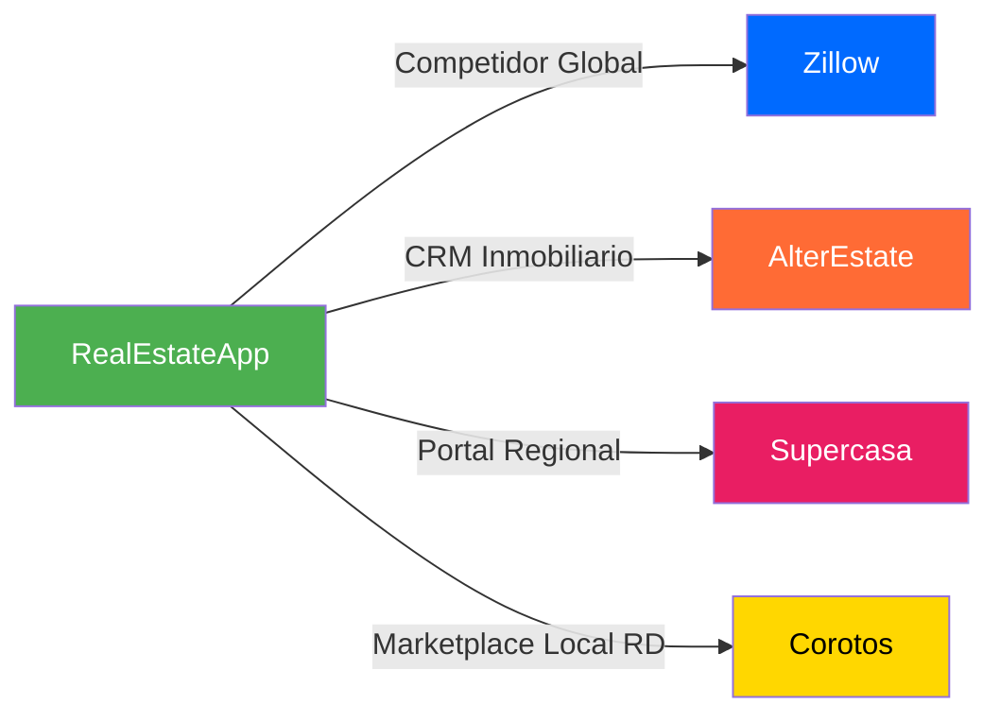
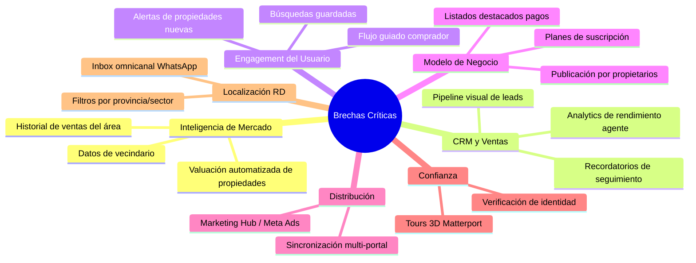

# 🏢 Análisis Competitivo Completo — RealEstateApp vs. Competidores

> **Fecha**: Agosto 2026  
> **Plataformas analizadas**: Zillow · AlterEstate · Supercasa · Corotos  
> **Mercado objetivo**: República Dominicana (RD$)

---

## 📊 Resumen Ejecutivo

Tu aplicación **RealEstateApp** tiene una base sólida con arquitectura empresarial (Onion/.NET 10), pero le faltan **funcionalidades críticas** para competir con las plataformas líderes. Este informe identifica **47 brechas funcionales** clasificadas por prioridad, con una hoja de ruta para cerrar cada una.

---

## 🔍 1. Inventario de Features Actuales de RealEstateApp

### ✅ Lo que TU APP ya tiene

| Categoría | Feature | Estado |
|-----------|---------|--------|
| **Búsqueda** | Filtro multicriterio (tipo, precio, habitaciones, baños) | ✅ |
| **Búsqueda** | Búsqueda por código único (6 dígitos) | ✅ |
| **Búsqueda** | Filtro por radio geográfico (Haversine) | ✅ |
| **Búsqueda** | Vista de mapa interactivo (Leaflet + MarkerCluster) | ✅ |
| **Listados** | Galería de hasta 15 fotos con lightbox/zoom (GLightbox) | ✅ |
| **Listados** | Video Tour URL + Tour Virtual 360° URL | ✅ |
| **Listados** | Geolocalización (latitud/longitud) | ✅ |
| **Finanzas** | Simulador hipotecario (amortización francesa, RD$) | ✅ |
| **Finanzas** | Tabla amortizada exportable a PDF | ✅ |
| **Negociación** | Sistema de ofertas (Pendiente/Aceptada/Rechazada) | ✅ |
| **Negociación** | Contra-ofertas bidireccionales | ✅ |
| **Negociación** | Regla atómica (venta automática en cascada) | ✅ |
| **Comunicación** | Chat en tiempo real (SignalR/WebSockets) | ✅ |
| **Comunicación** | Notificaciones push en tiempo real | ✅ |
| **UX** | Modo oscuro con persistencia | ✅ |
| **UX** | PWA (instalable + offline) | ✅ |
| **UX** | Comparador de propiedades (hasta 4) | ✅ |
| **Admin** | Dashboard con KPIs y gráficas (Chart.js) | ✅ |
| **Admin** | Gestión de agentes (activar/inactivar/eliminar cascada) | ✅ |
| **Admin** | Reasignación de cartera entre agentes | ✅ |
| **Agenda** | Sistema de citas (FullCalendar.js) | ✅ |
| **Favoritos** | Panel de favoritos del cliente | ✅ |
| **API** | REST API con JWT + Swagger | ✅ |
| **Roles** | 4 roles (Admin, Agente, Cliente, Desarrollador) | ✅ |
| **Actividad** | Historial de actividades del usuario | ✅ |
| **Integración** | WhatsApp Service (básico) | ✅ |

---

## 🆚 2. Análisis Detallado por Competidor

---

### 🔵 ZILLOW — El Estándar Global

> *Housing Super App | 200M+ usuarios mensuales | EE.UU.*

#### Lo que Zillow tiene y TU APP NO:

| # | Feature de Zillow | Impacto en tu App | Prioridad |
|---|-------------------|-------------------|-----------|
| 1 | **Zestimate (Valuación AI)** — Modelo de deep learning que estima valor de mercado con cientos de data points | Tu app no tiene valuación automatizada. El agente pone precio manualmente sin referencia de mercado | 🔴 ALTA |
| 2 | **AI Mode (Búsqueda Conversacional)** — "Muéstrame casas con piscina cerca de escuelas por menos de RD$5M" en lenguaje natural | Tu búsqueda es solo filtros tradicionales. No tiene procesamiento de lenguaje natural | 🟡 MEDIA |
| 3 | **Virtual Staging AI** — Redecora habitaciones vacías con estilos (Moderno, Escandinavo, etc.) | No existe. Tus fotos se muestran tal cual | 🟡 MEDIA |
| 4 | **3D Home Tour nativo** — Genera tours 3D desde un smartphone con IA | Solo tienes URL externa a tour 360°. No generas el tour | 🟡 MEDIA |
| 5 | **Planos interactivos (Floor Plans AI)** — Genera plano del inmueble desde fotos | No existe | 🟡 MEDIA |
| 6 | **BuyAbility℠** — Calcula poder adquisitivo personalizado según finanzas del usuario | Tu simulador calcula cuotas pero no evalúa la capacidad real del comprador | 🔴 ALTA |
| 7 | **Pre-aprobación verificada integrada** — Proceso de pre-aprobación hipotecaria dentro de la app | Solo subes carta de pre-aprobación como archivo. No hay proceso integrado | 🟡 MEDIA |
| 8 | **Colecciones compartidas (Co-shopping)** — Múltiples personas guardan/comparan propiedades juntas | Tu favoritos es individual. No hay colaboración | 🟡 MEDIA |
| 9 | **Mensajería in-app con co-shoppers** — Chat entre compradores, no solo con el agente | Tu chat es solo cliente ↔ agente. No hay chat entre compradores | 🟢 BAJA |
| 10 | **Hub personalizado por hitos** — Guía paso a paso desde búsqueda hasta cierre | No existe un flujo guiado para el comprador | 🔴 ALTA |
| 11 | **Tour Itineraries / SkyTour** — Organización visual de recorridos de visitas | Tu calendario de citas es básico. No hay planificación de rutas | 🟡 MEDIA |
| 12 | **Integración con ChatGPT** — Búsqueda de propiedades directamente desde ChatGPT | No existe | 🟢 BAJA |
| 13 | **Datos de vecindario** — Escuelas, crimen, transporte, walkability score | No existe | 🔴 ALTA |
| 14 | **Historial de ventas del área** — Propiedades vendidas recientemente en la zona con precios | No existe | 🔴 ALTA |

---

### 🟠 ALTERESTATE — El CRM Inmobiliario de LATAM

> *CRM especializado | Enfocado en agentes y agencias | Latinoamérica*

#### Lo que AlterEstate tiene y TU APP NO:

| # | Feature de AlterEstate | Impacto en tu App | Prioridad |
|---|------------------------|-------------------|-----------|
| 15 | **CRM completo con pipeline visual** — Embudo de ventas: Interesado → Visita → Oferta → Cierre | Tu agente solo ve ofertas y chats. No hay pipeline de leads ni seguimiento estructurado | 🔴 ALTA |
| 16 | **Inbox omnicanal** — Unifica WhatsApp, Email y SMS en una sola bandeja | Tu WhatsApp Service es básico y separado del chat SignalR. Canales no unificados | 🔴 ALTA |
| 17 | **Brik (Asistente AI virtual)** — Genera reportes, trackea clientes, organiza tareas automáticamente | No existe asistente AI. Todo es manual | 🟡 MEDIA |
| 18 | **Marketing Hub + Facebook Ads** — Integración directa con Meta Ads, leads sincronizados al CRM | No existe módulo de marketing. Sin integración con redes sociales para captación | 🔴 ALTA |
| 19 | **Sincronización multi-portal** — Publica automáticamente en múltiples portales inmobiliarios (MLS) | No existe. Cada propiedad solo vive en tu plataforma | 🔴 ALTA |
| 20 | **Generador de sitios web** — Los agentes pueden crear su propio sitio web de marca | No existe. Los agentes dependen 100% de tu plataforma | 🟡 MEDIA |
| 21 | **API de desarrolladores** — API documentada para integraciones externas | ✅ YA lo tienes parcialmente con tu Web API JWT | ✅ |
| 22 | **Analytics y reportes de negocio** — Métricas de rendimiento del agente, tasas de conversión, tiempo de cierre | Tu dashboard solo muestra conteos (propiedades disponibles/vendidas). No hay analytics profundos | 🔴 ALTA |
| 23 | **Notas de voz** — El agente puede dejar notas de voz por propiedad/cliente | No existe | 🟢 BAJA |
| 24 | **Recordatorios de seguimiento** — Alertas automáticas para hacer follow-up a leads | No existe. Sin sistema de recordatorios | 🟡 MEDIA |
| 25 | **Gestión de equipos** — Estructura de agencias con supervisores, equipos y permisos granulares | Solo tienes Admin y Agente. No hay estructura jerárquica de agencias | 🟡 MEDIA |

---

### 🔴 SUPERCASA — El Portal Regional Europeo

> *Portal inmobiliario líder en Portugal | Web + iOS + Android*

#### Lo que Supercasa tiene y TU APP NO:

| # | Feature de Supercasa | Impacto en tu App | Prioridad |
|---|----------------------|-------------------|-----------|
| 26 | **Búsqueda "Cerca de mí" nativa** — Usa GPS para encontrar propiedades cercanas | ✅ Ya lo tienes con Haversine + Geolocation API | ✅ |
| 27 | **Alertas de nuevas propiedades** — Notificaciones cuando aparecen propiedades que coinciden con tus criterios guardados | No existe. El usuario debe buscar manualmente cada vez | 🔴 ALTA |
| 28 | **Búsquedas guardadas** — El usuario puede guardar filtros y recibirlos como suscripciones | No existe. Los filtros se pierden al cerrar la página | 🔴 ALTA |
| 29 | **Publicación gratuita para propietarios** — Hasta 2 propiedades gratis sin ser agente | Tu app requiere ser Agente registrado para publicar. Los propietarios no pueden listar directamente | 🔴 ALTA |
| 30 | **Valuación de propiedad (Infocasa)** — Servicio de valoración integrado | No existe (igual que brecha #1) | 🔴 ALTA |
| 31 | **Exposición internacional** — Propiedades visibles en mercados internacionales (Francia, España, UK) | Tu app es solo local. No hay estrategia de exposición internacional | 🟡 MEDIA |
| 32 | **Integración con CRM eGO** — Conexión directa con el CRM líder de Portugal/España | Tu app no se integra con ningún CRM externo | 🟡 MEDIA |
| 33 | **Cuentas profesionales para agencias** — Perfil de agencia con branding y portafolio | Tu perfil de agente es básico. No hay concepto de "agencia" como entidad | 🟡 MEDIA |
| 34 | **Multi-idioma** — Español, Inglés, Francés, etc. | Tu app es solo en español | 🟡 MEDIA |

---

### 🟡 COROTOS — El Marketplace Local Dominicano

> *Marketplace #1 de RD | Tu competidor DIRECTO más relevante*

> [!IMPORTANT]
> **Corotos es tu competidor más inmediato** porque opera en el mismo mercado (República Dominicana). Las brechas con Corotos deben considerarse de máxima prioridad.

#### Lo que Corotos tiene y TU APP NO:

| # | Feature de Corotos | Impacto en tu App | Prioridad |
|---|-------------------|-------------------|-----------|
| 35 | **Tours virtuales Matterport 3D** — Recorridos 3D inmersivos profesionales integrados | Tu app solo acepta URL externa. No hay integración con Matterport ni visor embebido | 🔴 ALTA |
| 36 | **Cuentas verificadas** — Badge de verificación de identidad para vendedores | No existe sistema de verificación de identidad. Cualquier agente activo tiene la misma credibilidad | 🔴 ALTA |
| 37 | **Agendamiento por WhatsApp** — Leads pueden agendar visitas directamente por WhatsApp | Tu agendamiento es solo por la app web. No hay integración WhatsApp para citas | 🟡 MEDIA |
| 38 | **Planes Pro/Premium para agentes** — Herramientas avanzadas para destacar listados | No existe modelo de suscripción ni listados destacados | 🔴 ALTA |
| 39 | **Destacar proyectos nuevos** — Sección específica para desarrollos/proyectos inmobiliarios | Tu app trata todas las propiedades igual. No hay concepto de "proyecto" o "desarrollo" | 🟡 MEDIA |
| 40 | **App nativa iOS/Android** — Experiencia nativa con notificaciones push del sistema | Solo tienes PWA. No tienes app nativa en las tiendas | 🟡 MEDIA |
| 41 | **Publicación gratuita con fotos** — Cualquier persona puede publicar un anuncio gratis | Misma brecha que #29. Solo agentes pueden publicar | 🔴 ALTA |
| 42 | **Filtros por región específica de RD** — Santo Domingo, Santiago, La Romana, etc. | Tu filtro de ubicación es por coordenadas pero no por región/provincia/sector | 🔴 ALTA |
| 43 | **Notificaciones de leads en tiempo real** — Push notifications para nuevos interesados | Tu sistema de notificaciones existe en la web pero no como push notifications del sistema operativo | 🟡 MEDIA |

---

## 🚨 3. Brechas Críticas Consolidadas (Gap Analysis)

### 🔴 PRIORIDAD ALTA — Sin estas features NO puedes competir

| # | Brecha | Presente en | Impacto de NO tenerla |
|---|--------|-------------|----------------------|
| 1 | **Valuación automatizada** | Zillow, Supercasa | Agentes ponen precios sin referencia; compradores no confían en los precios |
| 2 | **CRM con pipeline visual** | AlterEstate | Agentes pierden leads; no hay visibilidad del embudo de ventas |
| 3 | **Alertas de nuevas propiedades** | Supercasa, Zillow | Usuarios no regresan a la app; baja retención |
| 4 | **Búsquedas guardadas** | Supercasa, Zillow | Los usuarios deben refiltrar cada vez; experiencia frustrante |
| 5 | **Planes de suscripción** | AlterEstate, Corotos | Sin modelo de monetización sostenible |
| 6 | **Sincronización multi-portal** | AlterEstate, Supercasa | Las propiedades solo existen en tu plataforma; alcance limitado |
| 7 | **Inbox omnicanal (WhatsApp unificado)** | AlterEstate | Comunicación fragmentada; leads perdidos en canales externos |
| 8 | **Verificación de identidad** | Corotos | Falta de confianza en los agentes; barrera para compradores |
| 9 | **Marketing Hub / Meta Ads** | AlterEstate | Los agentes no pueden captar leads desde redes sociales |
| 10 | **Filtros por provincia/sector RD** | Corotos | Tu competidor local tiene mejor búsqueda para el mercado dominicano |
| 11 | **Publicación por propietarios** | Supercasa, Corotos | Pierdes volumen de listados; los propietarios van a Corotos |
| 12 | **Flujo guiado del comprador** | Zillow | El comprador está perdido sin un camino claro de la búsqueda al cierre |
| 13 | **Tours 3D integrados (Matterport)** | Corotos, Zillow | Tu competidor local directo ya ofrece esto |
| 14 | **Analytics avanzados del agente** | AlterEstate | El agente no puede medir su rendimiento ni optimizar su trabajo |
| 15 | **Datos de vecindario** | Zillow | El comprador no tiene contexto sobre la zona |
| 16 | **Listados destacados (premium)** | Corotos, AlterEstate | Sin fuente de ingresos por visibilidad premium |
| 17 | **BuyAbility (capacidad de compra)** | Zillow | Tu simulador calcula cuotas pero no evalúa si el comprador puede pagar |

---

## 📈 4. Matriz Comparativa Completa

| Feature | RealEstateApp | Zillow | AlterEstate | Supercasa | Corotos |
|---------|:---:|:---:|:---:|:---:|:---:|
| **BÚSQUEDA** | | | | | |
| Filtros básicos (precio, tipo, habitaciones) | ✅ | ✅ | ✅ | ✅ | ✅ |
| Búsqueda por código único | ✅ | ❌ | ❌ | ❌ | ❌ |
| Mapa interactivo | ✅ | ✅ | ❌ | ✅ | ❌ |
| Cerca de mí (GPS) | ✅ | ✅ | ❌ | ✅ | ❌ |
| Búsqueda por lenguaje natural (AI) | ❌ | ✅ | ✅ | ❌ | ❌ |
| Búsquedas guardadas + alertas | ❌ | ✅ | ❌ | ✅ | ❌ |
| Filtros por región/provincia | ❌ | ✅ | ❌ | ✅ | ✅ |
| **VISUALIZACIÓN** | | | | | |
| Galería de fotos con lightbox | ✅ | ✅ | ✅ | ✅ | ✅ |
| Tour Virtual 360° (URL) | ✅ | ✅ | ❌ | ❌ | ❌ |
| Tours 3D Matterport integrados | ❌ | ✅ | ❌ | ❌ | ✅ |
| Virtual Staging AI | ❌ | ✅ | ❌ | ❌ | ❌ |
| Planos interactivos (floor plans) | ❌ | ✅ | ❌ | ❌ | ❌ |
| Comparador de propiedades | ✅ | ✅ | ❌ | ❌ | ❌ |
| **FINANZAS** | | | | | |
| Simulador hipotecario | ✅ | ✅ | ❌ | ❌ | ❌ |
| Valuación automatizada (AVM) | ❌ | ✅ | ❌ | ✅ | ❌ |
| Pre-aprobación integrada | ❌ | ✅ | ❌ | ❌ | ❌ |
| Capacidad de compra (BuyAbility) | ❌ | ✅ | ❌ | ❌ | ❌ |
| Multi-moneda (USD + RD$) | ❌ | ❌ | ❌ | ❌ | ❌ |
| **NEGOCIACIÓN** | | | | | |
| Sistema de ofertas | ✅ | ✅ | ❌ | ❌ | ❌ |
| Contra-ofertas | ✅ | ❌ | ❌ | ❌ | ❌ |
| Venta atómica (cascada auto) | ✅ | ❌ | ❌ | ❌ | ❌ |
| **COMUNICACIÓN** | | | | | |
| Chat en tiempo real (WebSocket) | ✅ | ✅ | ❌ | ❌ | ✅ |
| Notificaciones push web | ✅ | ✅ | ✅ | ✅ | ✅ |
| Inbox omnicanal (WA + Email + SMS) | ❌ | ❌ | ✅ | ❌ | ❌ |
| Co-shopping / chat grupal | ❌ | ✅ | ❌ | ❌ | ❌ |
| **CRM / AGENTE** | | | | | |
| Pipeline visual de leads | ❌ | ❌ | ✅ | ❌ | ❌ |
| Analytics de rendimiento | ❌ | ❌ | ✅ | ❌ | ❌ |
| Recordatorios de seguimiento | ❌ | ❌ | ✅ | ❌ | ❌ |
| Notas por cliente | ❌ | ❌ | ✅ | ❌ | ❌ |
| Marketing Hub / Meta Ads | ❌ | ❌ | ✅ | ❌ | ❌ |
| Sincronización multi-portal | ❌ | ❌ | ✅ | ✅ | ❌ |
| **ADMINISTRACIÓN** | | | | | |
| Dashboard con KPIs | ✅ | ✅ | ✅ | ❌ | ❌ |
| Gestión de agentes | ✅ | ❌ | ✅ | ❌ | ❌ |
| CRUDs de catálogos | ✅ | ❌ | ✅ | ❌ | ❌ |
| Gestión de equipos/agencias | ❌ | ❌ | ✅ | ✅ | ❌ |
| **MODELO DE NEGOCIO** | | | | | |
| Planes de suscripción | ❌ | ✅ | ✅ | ❌ | ✅ |
| Listados destacados (pagos) | ❌ | ✅ | ✅ | ✅ | ✅ |
| Publicación por propietarios | ❌ | ✅ | ❌ | ✅ | ✅ |
| Verificación de identidad | ❌ | ❌ | ❌ | ❌ | ✅ |
| **PLATAFORMA** | | | | | |
| PWA | ✅ | ❌ | ❌ | ❌ | ❌ |
| App nativa iOS/Android | ❌ | ✅ | ✅ | ✅ | ✅ |
| API REST pública | ✅ | ✅ | ✅ | ❌ | ❌ |
| Multi-idioma | ❌ | ✅ | ✅ | ✅ | ❌ |
| Modo oscuro | ✅ | ✅ | ❌ | ❌ | ❌ |
| Agenda de citas (FullCalendar) | ✅ | ❌ | ✅ | ❌ | ❌ |
| Asistente AI integrado | ❌ | ✅ | ✅ | ❌ | ❌ |

---

## 🏆 5. Ventajas Competitivas ÚNICAS de tu App

> [!TIP]
> Estas son features que **ninguno o casi ninguno** de tus competidores tiene. Son tus diferenciadores.

| Ventaja Exclusiva | Detalle | Quién más la tiene |
|---|---|---|
| 🔥 **Contra-ofertas bidireccionales** | Flujo completo de negociación agente ↔ cliente con aceptación/rechazo | Ninguno de los 4 |
| 🔥 **Regla atómica de venta en cascada** | Al aceptar una oferta, todas las demás se rechazan automáticamente y la propiedad cambia de estado | Ninguno de los 4 |
| 🔥 **Búsqueda por código único de 6 dígitos** | Compartir una propiedad es tan simple como un código | Ninguno de los 4 |
| 🔥 **Simulador hipotecario en RD$** | Adaptado al mercado dominicano con amortización francesa | Solo Zillow (pero en USD) |
| 🔥 **PWA instalable con offline** | App web que se instala como nativa sin app store | Ninguno de los 4 |
| 🔥 **Comparador visual de hasta 4 propiedades** | Tabla lado a lado con especificaciones | Solo Zillow |
| ⚡ **Monto de separación configurable** | Feature única para el mercado dominicano | Ninguno de los 4 |
| ⚡ **% inicial requerido configurable** | Personalizable por propiedad | Ninguno de los 4 |

---

## 🗺️ 6. Plan de Acción Recomendado por Fases

### 🚀 Fase 1 — Paridad Competitiva con Corotos (4-6 semanas)
*Tu competidor local más directo. Debes igualar sus features primero.*

| Acción | Archivos Afectados | Esfuerzo |
|--------|-------------------|----------|
| Filtros por provincia/sector de RD | [Property.cs](file:///c:/Users/DELL/Desktop/New%20folder/RealEstateApp/src/Core/RealEstateApp.Core.Domain/Entities/Property.cs), [HomeController.cs](file:///c:/Users/DELL/Desktop/New%20folder/RealEstateApp/src/Presentation/RealEstateApp.Presentation.WebApp/Controllers/HomeController.cs) — Agregar campo `Province`/`Sector` | 🟢 Bajo |
| Verificación de identidad de agentes | Nueva entidad `AgentVerification`, badge en UI | 🟡 Medio |
| Integración Matterport (visor embebido) | [Property.cs](file:///c:/Users/DELL/Desktop/New%20folder/RealEstateApp/src/Core/RealEstateApp.Core.Domain/Entities/Property.cs) — Nuevo campo `MatterportId`, `<iframe>` en Details | 🟢 Bajo |
| Publicación por propietarios (rol "Propietario") | Nuevo rol en Identity Seeds, formulario simplificado de publicación | 🟡 Medio |
| Planes Pro/Premium (modelo suscripción) | Nuevas entidades `Subscription`, `Plan`, integración pasarela de pagos | 🔴 Alto |
| Listados destacados | Campo `IsFeatured` en [Property.cs](file:///c:/Users/DELL/Desktop/New%20folder/RealEstateApp/src/Core/RealEstateApp.Core.Domain/Entities/Property.cs), sort priority en queries | 🟢 Bajo |

---

### 📊 Fase 2 — Inteligencia de Mercado (6-8 semanas)
*Funcionalidades que generan valor real para compradores y agentes.*

| Acción | Detalle | Esfuerzo |
|--------|---------|----------|
| Valuación automatizada (AVM básica) | Algoritmo de comparables: precio/m² promedio por zona, tipo y características | 🟡 Medio |
| Búsquedas guardadas + alertas por email | Nueva entidad `SavedSearch` con Hangfire job periódico | 🟡 Medio |
| Datos de vecindario | Integración con APIs de datos RD (escuelas, comercios, transporte) o datos curados | 🔴 Alto |
| Historial de precios | Tabla `PriceHistory` con gráfica de evolución en Details | 🟢 Bajo |
| BuyAbility (capacidad de compra) | Extensión de [FinancingService.cs](file:///c:/Users/DELL/Desktop/New%20folder/RealEstateApp/src/Infrastructure/RealEstateApp.Infrastructure.Shared/Services/FinancingService.cs) con evaluación DTI ratio | 🟡 Medio |

---

### 💼 Fase 3 — CRM para Agentes (8-10 semanas)
*Lo que diferencia a AlterEstate y lo que retiene a los agentes en tu plataforma.*

| Acción | Detalle | Esfuerzo |
|--------|---------|----------|
| Pipeline visual de leads (embudo Kanban) | Nueva entidad `Lead` con estados, vista Kanban con drag & drop | 🔴 Alto |
| Inbox omnicanal | Unificar [ChatService.cs](file:///c:/Users/DELL/Desktop/New%20folder/RealEstateApp/src/Core/RealEstateApp.Core.Application/Services/ChatService.cs) + [WhatsAppService.cs](file:///c:/Users/DELL/Desktop/New%20folder/RealEstateApp/src/Infrastructure/RealEstateApp.Infrastructure.Shared/Services/WhatsAppService.cs) + EmailService en una sola bandeja | 🔴 Alto |
| Analytics de rendimiento del agente | Dashboard con tasa de conversión, tiempo promedio de cierre, leads por fuente | 🟡 Medio |
| Recordatorios de seguimiento | Entidad `Reminder` + Hangfire para notificaciones programadas | 🟡 Medio |
| Calculadora de comisiones | Servicio `CommissionService` con tracking por agente | 🟢 Bajo |

---

### 🌍 Fase 4 — Expansión y Alcance (10-12 semanas)

| Acción | Detalle | Esfuerzo |
|--------|---------|----------|
| Multi-idioma (i18n) | Archivos `.resx` para es-DO e en-US como mínimo | 🟡 Medio |
| Multi-moneda (USD + RD$) | API Banco Central RD + [IFinancingService.cs](file:///c:/Users/DELL/Desktop/New%20folder/RealEstateApp/src/Core/RealEstateApp.Core.Application/Interfaces/Services/IFinancingService.cs) | 🟡 Medio |
| Sincronización multi-portal (MLS) | Export XML/JSON feed para portales externos | 🔴 Alto |
| Marketing Hub básico | Integración con Meta Business API para leads de Facebook/Instagram | 🔴 Alto |
| Generación de sitio web del agente | Subdominio/página personalizable por agente | 🔴 Alto |

---

### 🤖 Fase 5 — Innovación con AI (12+ semanas)

| Acción | Detalle | Esfuerzo |
|--------|---------|----------|
| Búsqueda conversacional (AI Mode) | LLM + RAG sobre tu base de propiedades | 🔴 Alto |
| Asistente AI para agentes (tipo Brik) | Chatbot que resume leads, sugiere seguimiento, genera reportes | 🔴 Alto |
| Virtual Staging | Integración con API de generación de imágenes (Stability AI, DALL-E) | 🟡 Medio |
| Valuación AI avanzada | Modelo ML entrenado con datos de transacciones RD | 🔴 Alto |

---

## 📊 7. Scorecard Final

| Categoría | RealEstateApp | Zillow | AlterEstate | Supercasa | Corotos |
|-----------|:---:|:---:|:---:|:---:|:---:|
| Búsqueda y Descubrimiento | ⭐⭐⭐ | ⭐⭐⭐⭐⭐ | ⭐⭐⭐ | ⭐⭐⭐⭐ | ⭐⭐⭐ |
| Visualización de Propiedades | ⭐⭐⭐⭐ | ⭐⭐⭐⭐⭐ | ⭐⭐⭐ | ⭐⭐⭐ | ⭐⭐⭐⭐ |
| Herramientas Financieras | ⭐⭐⭐⭐ | ⭐⭐⭐⭐⭐ | ⭐⭐ | ⭐⭐⭐ | ⭐ |
| Negociación y Ofertas | ⭐⭐⭐⭐⭐ | ⭐⭐⭐ | ⭐⭐ | ⭐ | ⭐ |
| Comunicación | ⭐⭐⭐⭐ | ⭐⭐⭐⭐ | ⭐⭐⭐⭐⭐ | ⭐⭐ | ⭐⭐⭐ |
| CRM y Gestión de Agentes | ⭐⭐ | ⭐⭐ | ⭐⭐⭐⭐⭐ | ⭐⭐⭐ | ⭐ |
| Modelo de Negocio/Monetización | ⭐ | ⭐⭐⭐⭐⭐ | ⭐⭐⭐⭐⭐ | ⭐⭐⭐ | ⭐⭐⭐⭐ |
| Tecnología y Arquitectura | ⭐⭐⭐⭐ | ⭐⭐⭐⭐⭐ | ⭐⭐⭐⭐ | ⭐⭐⭐ | ⭐⭐⭐ |
| Localización para RD | ⭐⭐⭐ | ⭐ | ⭐⭐⭐ | ⭐ | ⭐⭐⭐⭐⭐ |
| AI e Innovación | ⭐ | ⭐⭐⭐⭐⭐ | ⭐⭐⭐⭐ | ⭐⭐ | ⭐⭐ |
| **PROMEDIO** | **⭐⭐⭐.1** | **⭐⭐⭐⭐.0** | **⭐⭐⭐.5** | **⭐⭐.5** | **⭐⭐.7** |

---

## 💡 8. Conclusión y Recomendación Estratégica

> [!IMPORTANT]
> ### Tu mayor fortaleza es tu **sistema de negociación** (contra-ofertas + venta atómica en cascada). NINGÚN competidor tiene esto.
> 
> ### Tu mayor debilidad es la **falta de monetización** y las **herramientas de CRM para agentes**. Sin estas, los agentes usarán AlterEstate para gestionar su trabajo y Corotos para publicar.

### Estrategia recomendada:

1. **Primero**, cierra las brechas con **Corotos** (tu competidor local directo en RD): filtros por región, verificación, Matterport, publicación por propietarios
2. **Segundo**, implementa un **modelo de monetización** (planes de suscripción + listados destacados) para hacer el negocio sostenible
3. **Tercero**, desarrolla el **CRM básico** para retener a los agentes en tu plataforma
4. **Cuarto**, diferénciate con **inteligencia de mercado** (valuación, datos de zona, alertas)
5. **Finalmente**, innova con **AI** para posicionarte como la plataforma más avanzada del mercado dominicano

> [!TIP]
> **Tu app tiene una arquitectura técnica superior** (Onion Architecture, Clean Code, .NET 10) que facilita agregar estas features sin reescribir. La inversión en arquitectura ya hecha es tu mayor ventaja para escalar rápidamente.

---

*Informe generado por análisis exhaustivo del código fuente de RealEstateApp e investigación de mercado de las 4 plataformas competidoras.*
