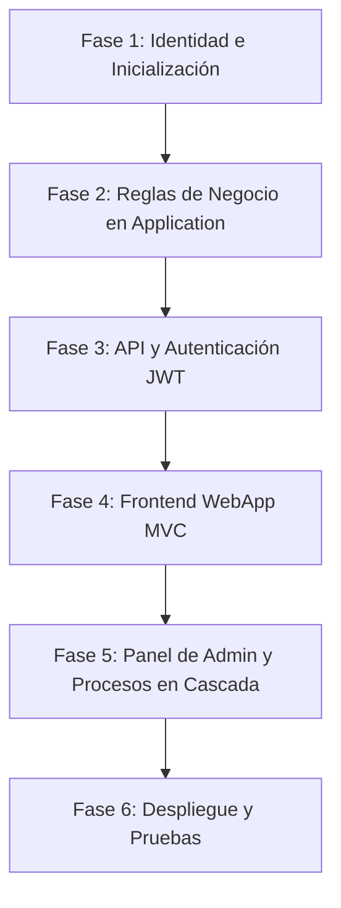

# Hoja de Ruta (Roadmap) para la Finalización del Proyecto RealEstateApp V2

A continuación se presenta la lista detallada y ordenada de todos los pasos lógicos requeridos para completar el desarrollo de la plataforma, guiándonos por las especificaciones de los documentos funcionales y el anexo de mejoras.

---

## 🗺️ Fases del Proyecto en Orden Lógico

---

## 📋 Detalle de los Pasos Requeridos

### Fase 1: Configuración de Identidad y Semillas de Datos (Persistencia)
Establecer la base de usuarios y seguridad necesaria para toda la aplicación.

1. **Implementar ASP.NET Core Identity**
   - Configurar Identity en `RealEstateApp.Infrastructure.Persistence` usando `IdentityUser` y `IdentityRole`.
   - Crear las relaciones de base de datos entre el usuario de Identity y las entidades de negocio (por ejemplo, el enlace entre `Property.AgentId` o `Offer.ClienteId` con la tabla de usuarios).
2. **Crear Inicializadores de Datos (Seeds)**
   - Implementar un inicializador (Seed) automático que se ejecute al iniciar la app.
   - Debe crear los roles: `Administrador`, `Agente`, `Cliente` y `Desarrollador`.
   - Debe crear los usuarios por defecto: un administrador activo, un cliente activo, un agente activo y un desarrollador activo.
3. **Mapeo de Relaciones Avanzadas en DB Context**
   - Configurar la relación entre `Property` y `Improvement` mediante Fluent API (muchos a muchos).
   - Configurar la geolocalización espacial en Entity Framework usando `NetTopologySuite`.

---

### Fase 2: Desarrollo de Lógica de Negocio y Servicios (Application & Shared)
Construir los motores principales que controlan la lógica transaccional, cálculos matemáticos e integraciones con terceros.

4. **Implementar el Simulador Hipotecario (`FinancingService`)**
   - Desarrollar la fórmula de **amortización francesa** en C# para proyectar cuotas mensuales basándose en: `MontoInicialAportado` (ej. 30%), `TasaInteresAnual` y el precio del inmueble.
5. **Configurar el Almacenamiento en la Nube (`IFileStorageService`)**
   - Implementar la carga real o mockeada a la nube (AWS S3 o Azure Blobs) que permita subir hasta 15 imágenes por propiedad.
6. **Implementar la Pasarela de Pagos (`PaymentService`)**
   - Crear el SDK o adaptador para simular el cobro de la reserva de separación (`MontoSeparacion`) al momento de aceptar o proponer una separación.
7. **Crear Mappings de AutoMapper y Perfiles**
   - Definir mapeos limpios entre entidades de dominio, ViewModels y DTOs expuestos en la API.

---

### Fase 3: Exposición de Servicios Internos y Seguridad JWT (Web API)
Habilitar los servicios de API consumibles de forma externa.

8. **Implementar Autenticación por Tokens (JWT Bearer)**
   - Configurar el middleware de JWT en `Program.cs` de la Web API.
   - Crear el `AccountController` de la API para permitir `Login` (retornar Token, Roles, Expiración) y registro de usuarios con roles autorizados.
9. **Desarrollar Controladores REST de la API**
   - `PropertiesController`: Consultas públicas y filtradas (List, GetById, GetByCode).
   - `AgentsController`: Mantenimiento y consulta de agentes; endpoint `ChangeStatus` (PATCH) para activar/inactivar agentes (reservado solo para Administradores).
   - Mantenimientos core de la API (`PropertyTypesController`, `SaleTypesController`, `ImprovementsController`).
10. **Documentar con Swagger OpenAPI**
    - Configurar Swagger para soportar el esquema de autenticación "Bearer Token" y autogenerar documentación de los contratos de servicio.

---

### Fase 4: Interfaz de Usuario y Experiencia del Cliente (Presentation.WebApp - MVC)
Desarrollar el portal web para visitantes y clientes autenticados.

11. **Diseñar el Portal Público (Home, Catálogo e Identidad)**
    - Crear el catálogo en orden cronológico inverso.
    - Implementar el buscador por código único de 6 dígitos autogenerado y el formulario de filtros combinados.
    - Implementar el directorio de agentes con su portafolio de inmuebles.
12. **Crear Flujo de Registro ("Únete a la app") y Activación de Cuentas**
    - Registro de Clientes y Agentes en estado **Inactivo** por defecto.
    - **Flujo Cliente**: Envío asíncrono de correo de activación mediante `GenerateEmailConfirmationTokenAsync` (Fase 1).
    - **Flujo Agente**: Notificación de que requiere activación manual por parte del Administrador.
13. **Desarrollar el Panel de Clientes (Autenticados)**
    - Panel de "Mis Favoritos" (depuración automática de propiedades vendidas).
    - Módulo de Chat: Hilo bidireccional directo con el agente por propiedad.
    - Módulo de Ofertas: Formulario para enviar propuestas con cálculo dinámico y carga de carta de pre-aprobación bancaria.

---

### Fase 5: Panel del Agente y del Administrador (Presentation.WebApp - MVC)
Desarrollar las vistas de negocio y las funcionalidades del backoffice.

14. **Módulo de Agente Inmobiliario**
    - CRUD de Propiedades (Subida de hasta 15 imágenes, geolocalización interactiva con Google Maps/Mapbox, URLs de vídeos y tours 360).
    - Panel de Ofertas Recibidas con la **Regla de Negocio Atómica**: al Aceptar una oferta, cambiar automáticamente el inmueble a *Vendido*, rechazar en cascada el resto de ofertas competidoras y bloquear nuevas propuestas.
15. **Módulo del Administrador (Backoffice)**
    - Dashboard principal con indicadores exactos en tiempo real.
    - CRUDs de tipos de propiedades, tipos de ventas y mejoras.
    - Activación/Inactivación y **Eliminación Física en Cascada** de agentes, asegurando que se limpien registros huérfanos de favoritos, ofertas, chats e imágenes vinculadas.

---

### Fase 6: Pruebas, Optimización y Entrega
Validación del software completo.

16. **Validación de Seguridad Cruzada**
    - Comprobar que un Desarrollador no pueda iniciar sesión en la WebApp y que un Cliente/Agente no pueda usar la Web API.
17. **Pruebas de Integración y Regresión**
    - Validar flujos de extremo a extremo (Registro -> Compra -> Aceptación de oferta -> Inactivación/Borrado en cascada).
