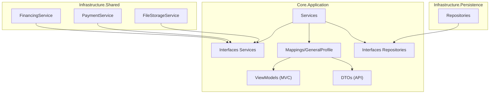

# Ficha Técnica del Proyecto: RealEstateApp V2 — Fase 2 (Lógica de Negocio, Servicios y Mappings)

Este documento contiene un resumen técnico exhaustivo y de bajo nivel de todos los cambios, archivos creados, modificados y configurados durante la **Fase 2: Desarrollo de Lógica de Negocio y Servicios (Application & Shared)** del proyecto **RealEstateApp V2**. Está estructurado para ser leído y procesado por cualquier Modelo de Lenguaje (IA) para su estudio o explicación al detalle.

---

## 🏗️ 1. Alcance de la Fase 2

La Fase 2 construyó los **motores principales** de la aplicación sobre la infraestructura de datos establecida en la Fase 1. Se crearon ~50 archivos nuevos y se modificaron 4 existentes, organizados en 9 componentes:

1. **Simulador Hipotecario** — Sistema de amortización francesa en C#.
2. **Almacenamiento de Archivos** — Servicio mejorado con almacenamiento local real.
3. **Pasarela de Pagos** — Simulador SDK para cobro de separaciones.
4. **DTOs para API REST** — Objetos de transferencia con DataAnnotations.
5. **ViewModels para MVC** — Modelos de vista con validación completa.
6. **AutoMapper Profile** — Mapeos bidireccionales entre capas.
7. **Servicios de Aplicación** — Interfaces e implementaciones de lógica de negocio.
8. **Repositorios Especializados** — Interfaces e implementaciones con Eager Loading.
9. **Inyección de Dependencias** — Registro en las 3 capas.

```
RealEstateApp (Solution)
 ├── src
 │    ├── Core
 │    │    ├── RealEstateApp.Core.Domain         ✅ Sin cambios (Fase 1 completa)
 │    │    └── RealEstateApp.Core.Application    ⭐ FOCO PRINCIPAL (DTOs, VMs, Servicios, Mappings)
 │    ├── Infrastructure
 │    │    ├── RealEstateApp.Infrastructure.Persistence ⭐ Repositorios especializados + DI
 │    │    └── RealEstateApp.Infrastructure.Shared      ⭐ FinancingService, PaymentService, FileStorage
 │    └── Presentation
 │         ├── RealEstateApp.Presentation.WebApp        ✅ Sin cambios directos
 │         └── RealEstateApp.Presentation.WebApi        ✅ Sin cambios directos
```

---

## 💾 2. Cambios en Detalle por Capas

### Capa 2.1: RealEstateApp.Infrastructure.Shared (Servicios de Infraestructura Cruzada)

#### A. Simulador Hipotecario — `FinancingService.cs`
Implementación del contrato `IFinancingService` (definido en Fase 1) usando el **sistema de amortización francesa** (cuota fija mensual).

- **Fórmula matemática implementada**: `M = P × [r(1+r)^n] / [(1+r)^n − 1]`
  - `P` = Monto del préstamo (`propertyPrice - downPayment`)
  - `r` = Tasa de interés mensual (`annualRate / 12 / 100`)
  - `n` = Total de periodos en meses (`termInYears × 12`)
- **Algoritmo paso a paso**:
  1. Calcula el monto del préstamo restando el enganche al precio.
  2. Convierte la tasa anual a tasa mensual decimal.
  3. Calcula la cuota fija mensual usando la fórmula de amortización.
  4. Itera mes a mes generando cada `AmortizationScheduleItem`:
     - `Interest` = Saldo restante × Tasa mensual (redondeado a 2 decimales).
     - `Principal` = Cuota fija − Interés.
     - `RemainingBalance` = Saldo anterior − Capital amortizado.
  5. **Ajuste del último periodo**: Para evitar errores acumulados de redondeo, el último pago de capital se iguala al saldo restante y la cuota se recalcula.
- **Caso especial**: Si la tasa de interés es 0%, divide el préstamo entre el total de meses.
- **Retorno**: `List<AmortizationScheduleItem>` con campos `Period`, `Installment`, `Interest`, `Principal`, `RemainingBalance`.

#### B. Almacenamiento de Archivos — `FileStorageService.cs` (Reescrito)
Se reemplazó la implementación simulada de la Fase 1 por un **almacenamiento local real** en disco.

- **Constructor**: Recibe `string basePath` (ruta absoluta a `wwwroot` o directorio equivalente).
- **`UploadFileAsync(Stream, fileName, containerName)`**:
  1. Genera nombre único: `{GUID}{extensión_original}` para evitar colisiones.
  2. Crea el directorio `{basePath}/uploads/{containerName}/` si no existe.
  3. Escribe el archivo al disco usando `FileStream`.
  4. Retorna URL relativa: `/uploads/{containerName}/{uniqueFileName}`.
- **`DeleteFileAsync(fileUrl, containerName)`**:
  1. Convierte la URL relativa a ruta del sistema de archivos.
  2. Elimina el archivo si existe en disco.
- **Diseño reemplazable**: En producción, se puede sustituir esta clase por una implementación de AWS S3 o Azure Blob Storage sin cambiar el contrato `IFileStorageService`.

#### C. Configuración de Almacenamiento — `FileStorageSettings.cs` (Nuevo)
- Ubicación: `Settings/FileStorageSettings.cs`
- Campos configurables:
  - `BasePath` (default: `"wwwroot"`): Directorio base.
  - `BaseUrl` (default: `""`): URL base para construir rutas públicas.
  - `AllowedImageExtensions` (default: `.jpg`, `.jpeg`, `.png`, `.webp`, `.gif`): Extensiones permitidas.
  - `MaxFileSizeBytes` (default: `5 * 1024 * 1024` = 5 MB): Tamaño máximo.

#### D. Pasarela de Pagos — `PaymentService.cs` (Nuevo)
Simulador de pasarela de pagos para el cobro del `MontoSeparacion`.

- **`ProcessPaymentAsync(PaymentRequest)`**:
  - Genera un `TransactionId` único basado en GUID (formato: `TXN-XXXXXXXXXXXXXXXX`).
  - Siempre retorna `Success = true` en modo desarrollo.
  - Registra la operación en `Console.WriteLine` con detalles del pago.
  - Retorna `PaymentResponse` con: `TransactionId`, `Amount`, `ProcessedAt`, `Message`.
- **`RefundPaymentAsync(string transactionId)`**:
  - Simula el reembolso de una transacción previamente cobrada.
  - Retorna `PaymentResponse` con el mismo `TransactionId` y `Success = true`.
- **Diseño reemplazable**: Preparado para sustituir con Stripe SDK, PayPal, etc.

#### E. Inyección de Dependencias — `ServiceRegistration.cs` (Modificado)
- **Método modificado**: `AddSharedInfrastructure(this IServiceCollection services, string webRootPath = "wwwroot")`
  - Nuevo parámetro opcional `webRootPath` con valor por defecto `"wwwroot"`.
  - Compatible con las llamadas existentes en `Program.cs` (WebApp y WebApi) sin romper nada.
- **Servicios registrados**:
  - `IEmailService → EmailService` (existente de Fase 1)
  - `IFileStorageService → FileStorageService(webRootPath)` (factory con inyección manual del path)
  - `IFinancingService → FinancingService` (nuevo)
  - `IPaymentService → PaymentService` (nuevo)
- **Lifetime**: Todos registrados como `Transient`.

---

### Capa 2.2: RealEstateApp.Core.Application — DTOs (Data Transfer Objects para API)

Todos los DTOs incluyen `DataAnnotations` para validación tanto en el servidor como en la documentación Swagger.

#### A. DTOs de Propiedad (`DTOs/Property/`)
1. **`PropertyDto.cs`**: DTO completo para exposición en API REST.
   - Campos con validación: `Code` (`[Required]`, `[StringLength(6)]`), `Price` (`[Range(0.01, MaxValue)]`), `SizeInMeters`, `Description` (`[StringLength(2000)]`), `VideoUrl` y `Tour360Url` (`[Url]`), `PorcentajeInicialRequerido` (`[Range(0, 100)]`).
   - Campos resueltos (flattened): `PropertyTypeName`, `SaleTypeName`, `AgentName`.
   - Colecciones: `Images` (`List<string>` de URLs), `Improvements` (`List<string>` de nombres).

#### B. DTOs de Catálogos (`DTOs/PropertyType/`, `DTOs/SaleType/`, `DTOs/Improvement/`)
2. **`PropertyTypeDto.cs`**: `Id`, `Name` (`[Required]`, `[StringLength(100)]`), `Description` (`[StringLength(500)]`), `PropertiesCount`.
3. **`SaleTypeDto.cs`**: Estructura idéntica a `PropertyTypeDto`.
4. **`ImprovementDto.cs`**: `Id`, `Name` (`[Required]`, `[StringLength(100)]`), `Description` (`[StringLength(500)]`).

#### C. DTOs de Agente (`DTOs/Agent/`)
5. **`AgentDto.cs`**: `Id` (string), `FirstName` y `LastName` (`[Required]`, `[StringLength(100)]`), `Email` (`[EmailAddress]`), `Phone` (`[Phone]`), `PropertiesCount`, `IsActive`, `Properties` (`List<AgentPropertyDto>?`).
6. **`AgentPropertyDto.cs`**: DTO ligero de propiedad asociada: `Id`, `Code`, `Price`, `Rooms`, `Bathrooms`, `SizeInMeters`, `Status`.

#### D. DTOs de Pagos (`DTOs/Payment/`)
7. **`PaymentRequest.cs`**: `Amount` (`[Required]`, `[Range(0.01, MaxValue)]`), `Currency` (`[StringLength(3, Min=3)]`, default `"DOP"`), `Description` (`[StringLength(500)]`), `ClienteId` (`[Required]`), `PropertyId` (`[Range(1, MaxValue)]`).
8. **`PaymentResponse.cs`**: `Success`, `TransactionId`, `Message`, `ProcessedAt`, `Amount`, `HasError`, `Error?`.

---

### Capa 2.3: RealEstateApp.Core.Application — ViewModels (Modelos de Vista para MVC)

Los ViewModels de escritura (Save*) incluyen `DataAnnotations` completos con `[Display(Name)]` para labels en español, `[DataType]` para renderizado apropiado, y mensajes de error personalizados en español.

#### A. ViewModels de Propiedad (`ViewModels/Property/`)
1. **`PropertyViewModel.cs`** — ViewModel de lectura para catálogo.
   - Datos resueltos: `PropertyTypeName`, `SaleTypeName`, `AgentName`, `Images` (List), `Improvements` (List).
   - Campos de contexto: `FavoritesCount`, `IsFavorite` (se resuelve en el servicio según el usuario actual).

2. **`SavePropertyViewModel.cs`** — ViewModel de formulario de creación/edición.
   - **14 campos con DataAnnotations completas**:
     - `Price`: `[Required]`, `[Range(0.01, MaxValue)]`, `[DataType(Currency)]`, `[Display(Name = "Precio")]`.
     - `Rooms`: `[Required]`, `[Range(0, 50)]`, `[Display(Name = "Habitaciones")]`.
     - `Bathrooms`: `[Required]`, `[Range(0, 30)]`, `[Display(Name = "Baños")]`.
     - `SizeInMeters`: `[Required]`, `[Range(1, 100000)]`, `[Display(Name = "Tamaño (m²)")]`.
     - `Description`: `[Required]`, `[StringLength(2000)]`, `[DataType(MultilineText)]`, `[Display(Name = "Descripción")]`.
     - `PropertyTypeId`: `[Required]`, `[Range(1, MaxValue)]` — valida que se seleccione del dropdown.
     - `SaleTypeId`: `[Required]`, `[Range(1, MaxValue)]`.
     - `Latitude`: `[Required]`, `[Range(-90, 90)]`, `[Display(Name = "Latitud")]`.
     - `Longitude`: `[Required]`, `[Range(-180, 180)]`, `[Display(Name = "Longitud")]`.
     - `VideoUrl`: `[Url]`, `[StringLength(500)]`, `[Display(Name = "URL del Video")]`.
     - `Tour360Url`: `[Url]`, `[StringLength(500)]`, `[Display(Name = "URL del Tour 360°")]`.
     - `MontoSeparacion`: `[Required]`, `[Range(0.01, MaxValue)]`, `[DataType(Currency)]`.
     - `PorcentajeInicialRequerido`: `[Required]`, `[Range(1, 100)]`.
   - `Files`: `List<IFormFile>?` — Subida de hasta 15 imágenes.
   - `ImprovementIds`: `List<int>?` — IDs de mejoras seleccionadas (checkboxes).
   - **Datos auxiliares para la vista**: `PropertyTypes`, `SaleTypes`, `Improvements` (listas para poblar dropdowns), `ExistingImages` (para edición).

3. **`PropertyFilterViewModel.cs`** — ViewModel de filtros del buscador.
   - Todos los campos son **opcionales** (nullable) para permitir filtros parciales.
   - Filtros: `Code`, `PropertyTypeId`, `SaleTypeId`, rango de precios (`MinPrice`/`MaxPrice` con `[DataType(Currency)]`), rango de habitaciones y baños, `AgentId`.
   - Incluye listas auxiliares `PropertyTypes` y `SaleTypes` para los dropdowns.

#### B. ViewModels de Catálogos
4. **`PropertyTypeViewModel.cs`**: Lectura con `PropertiesCount`.
5. **`SavePropertyTypeViewModel.cs`**: `Name` (`[Required]`, `[StringLength(100)]`, `[Display]`), `Description` (`[Required]`, `[StringLength(500)]`, `[DataType(MultilineText)]`, `[Display]`).
6. **`SaleTypeViewModel.cs`**: Lectura con `PropertiesCount`.
7. **`SaveSaleTypeViewModel.cs`**: Estructura idéntica a `SavePropertyTypeViewModel`.
8. **`ImprovementViewModel.cs`**: Lectura simple.
9. **`SaveImprovementViewModel.cs`**: `Name` (`[Required]`, `[StringLength(100)]`), `Description` (`[Required]`, `[StringLength(500)]`).

#### C. ViewModels de Ofertas (`ViewModels/Offer/`)
10. **`OfferViewModel.cs`**: Lectura con `MontoOfertado`, `Status` (string), `ClienteName`, `FechaOferta`, `PropertyCode`, `PropertyPrice`.
11. **`SaveOfferViewModel.cs`**: `MontoOfertado` (`[Required]`, `[Range(0.01, MaxValue)]`, `[DataType(Currency)]`), `PropertyId` (`[Required]`, `[Range(1, MaxValue)]`), `PreApprovalLetter` (`IFormFile?` para carta de pre-aprobación bancaria).

#### D. ViewModels de Chat (`ViewModels/Chat/`)
12. **`ChatViewModel.cs`**: Lectura con `ClienteName`, `AgenteName`, `SenderName`, `PropertyCode`, `MessageContent`, `SentAt`, `IsMine` (indica si el mensaje es del usuario actual).
13. **`SaveChatViewModel.cs`**: `PropertyId` (`[Required]`), `MessageContent` (`[Required]`, `[StringLength(2000)]`, `[DataType(MultilineText)]`), `RecipientId` (`[Required]`).

#### E. ViewModels de Favoritos y Agentes
14. **`FavoriteViewModel.cs`**: Datos aplanados de la propiedad: `PropertyCode`, `PropertyPrice`, `PropertyTypeName`, `PropertyRooms`, `PropertyBathrooms`, `PropertySizeInMeters`, `PropertyStatus`, `PropertyMainImage`.
15. **`AgentViewModel.cs`**: `FirstName`, `LastName`, `FullName` (computed: `$"{FirstName} {LastName}"`), `Email`, `Phone`, `IsActive`, `PropertiesCount`, `Properties` (lista opcional de `PropertyViewModel`).

#### F. ViewModels de Simulación Hipotecaria
16. **`MortgageSimulationResultViewModel.cs`** (Nuevo, en `ViewModels/MortgageSimulation/`): `LoanAmount`, `MonthlyInstallment`, `TotalInterest`, `TotalPaid`, `TermInYears`, `AnnualRate`, `PropertyPrice`, `DownPayment`, `Schedule` (`List<AmortizationScheduleItem>`).
    - *Nota*: `MortgageSimulationViewModel.cs` (el formulario de entrada) ya existía de la Fase 1.

---

### Capa 2.4: RealEstateApp.Core.Application — AutoMapper Mappings

#### `Mappings/GeneralProfile.cs`
Perfil único que centraliza **todos los mapeos** del proyecto. Hereda de `AutoMapper.Profile`.

- **Técnica**: Usa **alias de namespace** (`using VmPropertyType = ...`) para resolver ambigüedades entre entidades de dominio y ViewModels que comparten nombre.

**Mapeos configurados** (24 mapeos en total):

| Origen | Destino | Campos Especiales |
|--------|---------|-------------------|
| `Property` → `PropertyViewModel` | Flattening | `PropertyTypeName`, `SaleTypeName`, `Images` (Select URLs), `Improvements` (via join), `FavoritesCount`. Ignora: `AgentName`, `IsFavorite` (se resuelven en servicio). |
| `Property` → `PropertyDto` | Flattening | Idéntico al anterior, sin `IsFavorite`/`FavoritesCount`. |
| `SavePropertyViewModel` → `Property` | Escritura | Ignora 9 campos: `Images` (IFormFile manual), `PropertyImprovements`, todas las navegaciones, `Status`, `AgentId`, `Code` (autogenerados). |
| `Property` → `SavePropertyViewModel` | Pre-fill | Mapea `ImprovementIds` (Select IDs), `ExistingImages` (Select URLs). Ignora: `Files`, listas de dropdown. |
| `PropertyType` ↔ `PropertyTypeViewModel` | Bidireccional | `PropertiesCount` = `Properties.Count`. |
| `PropertyType` ↔ `PropertyTypeDto` | Bidireccional | Igual. |
| `SavePropertyTypeViewModel` → `PropertyType` | Escritura | Ignora `Properties`. |
| `SaleType` ↔ (ViewModels/DTOs) | Bidireccional | Estructura idéntica a PropertyType. |
| `Improvement` ↔ (ViewModels/DTOs) | Bidireccional | Ignora `PropertyImprovements`. |
| `Offer` → `OfferViewModel` | Lectura | `Status` = `ToString()` (enum a string), `PropertyCode`, `PropertyPrice` vía navegación. Ignora `ClienteName`. |
| `SaveOfferViewModel` → `Offer` | Escritura | Ignora: `Status` (Pending), `ClienteId` (sesión), `FechaOferta` (UTC). |
| `Chat` → `ChatViewModel` | Lectura | `PropertyCode` vía navegación. Ignora 4 campos de nombres (se resuelven en servicio). |
| `SaveChatViewModel` → `Chat` | Escritura | Ignora: `ClienteId`, `AgenteId`, `SenderId`, `SentAt`. |
| `Favorite` → `FavoriteViewModel` | Lectura | Mapeo profundo: `PropertyCode`, `PropertyPrice`, `PropertyTypeName` (2 niveles), `PropertyRooms`, `PropertyBathrooms`, `PropertySizeInMeters`, `PropertyStatus`, `PropertyMainImage` (`Images.First().ImageUrl`). |

---

### Capa 2.5: RealEstateApp.Core.Application — Servicios de Aplicación

Servicios que orquestan la lógica de negocio, consumiendo repositorios y AutoMapper.

#### A. Interfaces de Servicio (`Interfaces/Services/`)
1. **`IPropertyService.cs`**: `GetAllViewModel()`, `GetByIdViewModel(int)`, `Add(SavePropertyViewModel)`, `Update(SavePropertyViewModel, int)`, `Delete(int)`, `GetAllWithFilters(PropertyFilterViewModel)`, `GetByAgentId(string)`, `GetByCode(string)`.
2. **`IPropertyTypeService.cs`**: CRUD estándar con `GetAllViewModel()`, `GetByIdSaveViewModel(int)`, `Add()`, `Update()`, `Delete()`.
3. **`ISaleTypeService.cs`**: Estructura idéntica a `IPropertyTypeService`.
4. **`IImprovementService.cs`**: Estructura idéntica a `IPropertyTypeService`.
5. **`IOfferService.cs`**: CRUD + `AcceptOffer(int offerId)` (regla atómica), `RejectOffer(int offerId)`, `GetByPropertyId(int)`, `GetByClienteId(string)`.
6. **`IChatService.cs`**: `GetChatThread(clienteId, agenteId, propertyId, currentUserId)`, `SendMessage(SaveChatViewModel, senderId)`, `GetUserChats(userId)`.
7. **`IFavoriteService.cs`**: `GetByClienteId(string)`, `AddFavorite(clienteId, propertyId)`, `RemoveFavorite(clienteId, propertyId)`, `IsFavorite(clienteId, propertyId)`.
8. **`IPaymentService.cs`**: `ProcessPaymentAsync(PaymentRequest)`, `RefundPaymentAsync(string transactionId)`.

#### B. Implementaciones de Servicio (`Services/`)

1. **`PropertyService.cs`** — Servicio más complejo.
   - **Código único autogenerado**: `Guid.NewGuid().ToString("N")[..6].ToUpper()` — genera 6 caracteres alfanuméricos.
   - **Filtros combinados**: Método `GetAllWithFilters()` aplica `Where` encadenados para: `Code`, `PropertyTypeId`, `SaleTypeId`, rango de precios, rango de habitaciones, rango de baños, `AgentId`. Todos los filtros son opcionales.
   - **Preservación de datos en Update**: Al editar, solo se sobrescriben los campos editables; `Code`, `AgentId` y `Status` se preservan.

2. **`OfferService.cs`** — Implementa la **Regla de Negocio Atómica** especificada en el documento funcional:
   - **`AcceptOffer(int offerId)`**:
     1. Valida que la oferta exista y esté en estado `Pending`.
     2. Cambia el estado de la oferta a `Accepted`.
     3. Obtiene la propiedad asociada y cambia su `Status` a `"Vendida"`.
     4. Obtiene **todas** las demás ofertas pendientes de esa propiedad y las cambia a `Rejected` (rechazo en cascada).
   - **`Add(SaveOfferViewModel, clienteId)`**: Valida que la propiedad exista y tenga `Status == "Disponible"`. Bloquea ofertas a propiedades no disponibles.

3. **`ChatService.cs`** — Chat bidireccional.
   - `GetChatThread()`: Obtiene mensajes ordenados cronológicamente y marca `IsMine` comparando `SenderId` con `currentUserId`.
   - `SendMessage()`: Establece `SenderId` y `SentAt` automáticamente.

4. **`FavoriteService.cs`** — Favoritos sin duplicados.
   - `AddFavorite()`: Verifica existencia previa con `GetByClienteAndPropertyAsync()` antes de insertar.
   - La depuración automática de propiedades vendidas se delega al repositorio.

5. **`PropertyTypeService.cs`**, **`SaleTypeService.cs`**, **`ImprovementService.cs`** — CRUD estándar.
   - Patrón idéntico: constructor con `IGenericRepository<T>` + `IMapper`, mapeo automático entidad ↔ ViewModel.

#### C. Inyección de Dependencias — `ServiceRegistration.cs` (Application)
- **Método**: `AddApplicationLayer(this IServiceCollection services)`
- **Registros añadidos** (7 servicios como `Transient`):
  - `IPropertyService → PropertyService`
  - `IPropertyTypeService → PropertyTypeService`
  - `ISaleTypeService → SaleTypeService`
  - `IImprovementService → ImprovementService`
  - `IOfferService → OfferService`
  - `IChatService → ChatService`
  - `IFavoriteService → FavoriteService`
- AutoMapper sigue registrándose vía `services.AddAutoMapper(Assembly.GetExecutingAssembly())` que escanea el assembly por clases que hereden de `Profile`.

---

### Capa 2.6: RealEstateApp.Infrastructure.Persistence — Repositorios Especializados

#### A. Interfaces de Repositorio (`Application/Interfaces/Repositories/`)
Todas extienden `IGenericRepository<T>` heredando: `AddAsync`, `UpdateAsync`, `DeleteAsync`, `GetAllAsync`, `GetByIdAsync`.

1. **`IPropertyTypeRepository.cs`**, **`ISaleTypeRepository.cs`**, **`IImprovementRepository.cs`**: Sin métodos adicionales (el genérico es suficiente).
2. **`IOfferRepository.cs`**: `GetByPropertyIdAsync(int)`, `GetByClienteIdAsync(string)`.
3. **`IChatRepository.cs`**: `GetChatThreadAsync(clienteId, agenteId, propertyId)`, `GetByUserIdAsync(userId)`.
4. **`IFavoriteRepository.cs`**: `GetByClienteIdAsync(clienteId)`, `GetByClienteAndPropertyAsync(clienteId, propertyId)`.
5. **`IPropertyImageRepository.cs`**: `GetByPropertyIdAsync(int)`.

#### B. Implementaciones de Repositorio (`Persistence/Repositories/`)

1. **`PropertyRepository.cs`** — Carga optimizada con **Eager Loading**.
   - **`GetAllAsync()`** override: 6 `.Include()`:
     - `PropertyType`, `SaleType`, `Images`, `PropertyImprovements` → `.ThenInclude(pi => pi.Improvement)`, `Favorites`.
     - Ordenamiento: `OrderByDescending(p => p.Created)` — orden cronológico inverso (según especificaciones).
   - **`GetByIdAsync(int)`** override: Mismos includes + `Offers` y `Chats` (necesarios en vista de detalle).

2. **`OfferRepository.cs`** — Consultas filtradas con Include.
   - `GetByPropertyIdAsync()`: Include `Property`, filtro por `PropertyId`, orden descendente por `FechaOferta`.
   - `GetByClienteIdAsync()`: Include `Property`, filtro por `ClienteId`.
   - Override `GetAllAsync()`: Include `Property`.

3. **`ChatRepository.cs`** — Consultas de hilo de chat.
   - `GetChatThreadAsync()`: Filtro por `ClienteId + AgenteId + PropertyId`, orden ascendente por `SentAt`.
   - `GetByUserIdAsync()`: Filtro OR (`ClienteId == userId || AgenteId == userId`), orden descendente.

4. **`FavoriteRepository.cs`** — **Depuración automática de propiedades vendidas**.
   - `GetByClienteIdAsync()`: Include `Property` → `PropertyType` e `Images`. Aplica filtro `.Where(f => f.Property.Status != "Vendida")` para excluir automáticamente favoritos de propiedades ya vendidas (según especificación funcional).
   - `GetByClienteAndPropertyAsync()`: Búsqueda directa para verificación de duplicados.

5. **`PropertyImageRepository.cs`**: `GetByPropertyIdAsync()` con filtro simple por `PropertyId`.

#### C. Inyección de Dependencias — `ServiceRegistration.cs` (Persistence)
- **Registros añadidos** (5 repositorios como `Scoped`):
  - `IPropertyRepository → PropertyRepository`
  - `IOfferRepository → OfferRepository`
  - `IChatRepository → ChatRepository`
  - `IFavoriteRepository → FavoriteRepository`
  - `IPropertyImageRepository → PropertyImageRepository`
- El repositorio genérico `IGenericRepository<> → GenericRepository<>` sigue registrado (de Fase 1).

---

### Capa 2.7: Modificación del Archivo de Proyecto (.csproj)

#### `RealEstateApp.Core.Application.csproj`
- **Cambio**: Se agregó `<FrameworkReference Include="Microsoft.AspNetCore.App" />`.
- **Razón de ser**: El tipo `IFormFile` usado en `SavePropertyViewModel.cs` y `SaveOfferViewModel.cs` reside en el namespace `Microsoft.AspNetCore.Http`, el cual solo está disponible a través de este FrameworkReference. Sin él, las clases que usan `IFormFile` no compilarían en una biblioteca de clases estándar.

---

## 📊 3. Resumen de DataAnnotations Utilizados

| Anotación | Uso | Ejemplo |
|-----------|-----|---------|
| `[Required(ErrorMessage)]` | Campos obligatorios en formularios | `Price`, `Name`, `Description`, `MontoOfertado` |
| `[Range(min, max, ErrorMessage)]` | Rango numérico válido | `Price(0.01, Max)`, `Rooms(0, 50)`, `Lat(-90, 90)` |
| `[StringLength(max, ErrorMessage)]` | Longitud máxima de texto | `Description(2000)`, `Name(100)`, `Currency(3, Min=3)` |
| `[DataType(DataType.X)]` | Tipo de renderizado en formulario | `Currency`, `MultilineText`, `Password` |
| `[Display(Name)]` | Etiqueta visible en formulario MVC | Todos los campos de formulario en español |
| `[Url(ErrorMessage)]` | Validación de formato URL | `VideoUrl`, `Tour360Url` |
| `[EmailAddress]` | Validación de formato email | `AgentDto.Email` |
| `[Phone]` | Validación de formato teléfono | `AgentDto.Phone` |

---

## 🔗 4. Diagrama de Dependencias de la Fase 2



---

## 🔍 5. Resultados de la Verificación

```
> dotnet build RealEstateApp.slnx
Build succeeded.
    14 Warning(s)   ← Pre-existentes (AutoMapper version mismatch, NuGet advisories)
    0 Error(s)
Time Elapsed 00:00:53.03
```

- Los 6 proyectos de la solución compilaron exitosamente.
- No se requirieron migraciones de base de datos (sin cambios en el modelo de dominio).
- No se modificaron los proyectos de Presentación (WebApp y WebApi).
- Los warnings son pre-existentes de la Fase 1 (desajuste de versiones entre `AutoMapper 16.2.0` y `AutoMapper.Extensions.Microsoft.DependencyInjection 12.0.1`).
